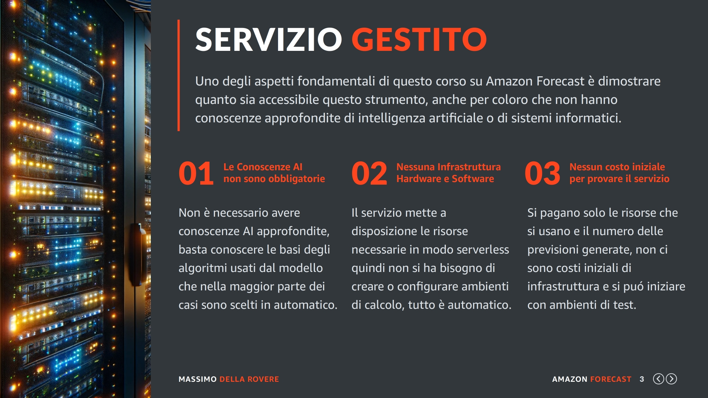
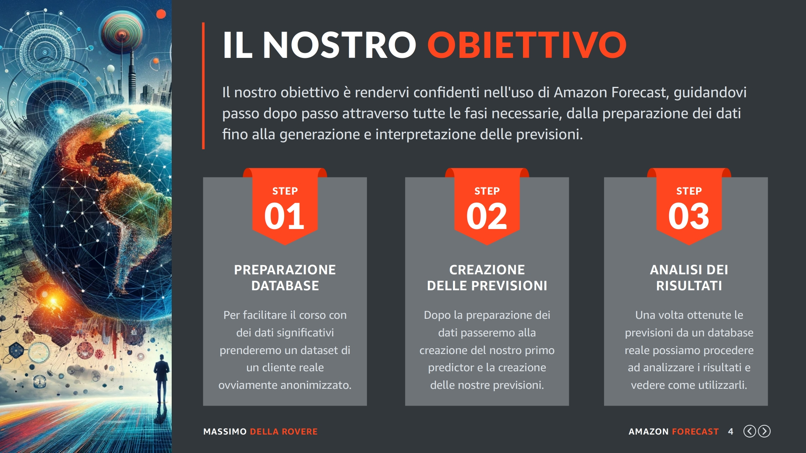
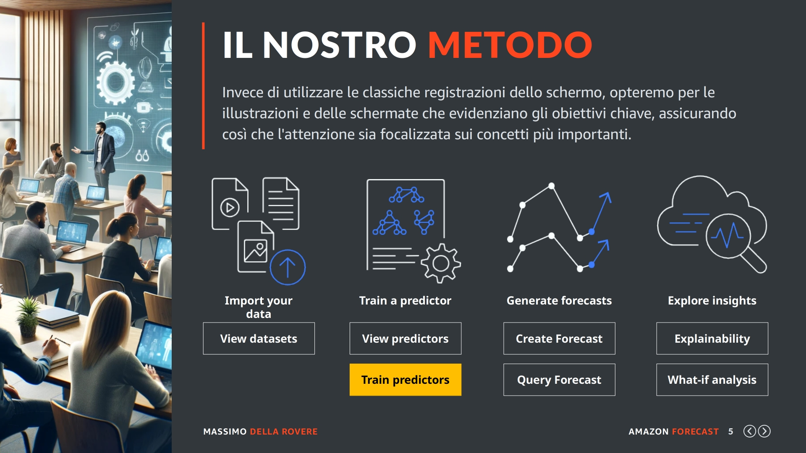
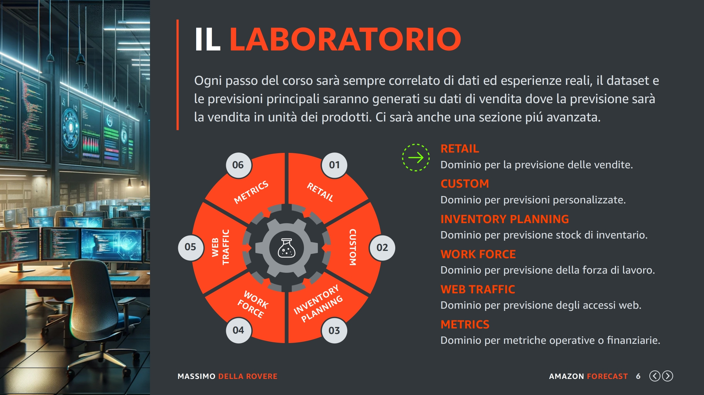
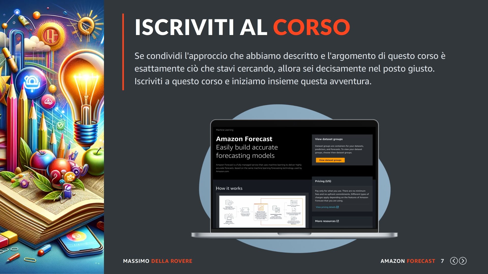

## (01: Presentazione)

Benvenuti, sono Massimo! È un piacere avervi qui con me come appassionati che vogliono scoprire le incredibili potenzialità dei servizi di intelligenza artificiale offerti da Amazon AWS. In questo percorso formativo, ci concentreremo su una gemma particolarmente brillante di questi servizi: Amazon Forecast.

## (02: Missione)

La nostra missione sarà quella di esplorare insieme come questo strumento possa trasformare i nostri dati storici in previsioni affidabili, aiutandoci a prendere decisioni più precise nel nostro ambito lavorativo e nei nostri progetti personali legati in qualche modo al mondo delle previsioni.

Quindi come possiamo vedere da questa slide le fase principali saranno la preparazione e l'analisi dei dati storici (chiamati dataset), la generazione delle previsioni e come utilizzarle per prendere delle decisioni.

## (03: Servizio)

Uno degli aspetti fondamentali di questo corso su Amazon Forecast è dimostrare quanto sia accessibile questo strumento, anche per coloro che non hanno conoscenze approfondite di intelligenza artificiale o di sistemi informatici.

Amazon Forecast è un servizio completamente gestito, progettato per semplificare al massimo l'implementazione delle previsioni basate sui dati temporali.

Normalmente un progetto AI ha bisogno di una conoscenza approfondita degli algoritmi da utilizzare, una infrastruttura hardware e software importante, tutto in un'ambiente scalabile in base alle nuove necessità di elaborazione.

Mentre grazie al servizio di Amazon Forecast:

**(1) Le Conoscenze AI non sono obbligatorie**

Non è necessario avere conoscenze AI approfondite, basta conoscere le basi degli algoritmi usati dal modello che nella maggior parte dei casi sono scelti in automatico.

**(2) Nessuna Infrastruttura Hardware e Software**

Il servizio mette a disposizione le risorse necessarie in modo serverless quindi non si ha bisogno di creare o configurare ambienti di calcolo, tutto è automatico.

**(3) Nessun costo iniziale per provare il servizio**

Si paga solo per le risorse che si usano e il numero delle previsioni che vengono richieste, non ci sono costi iniziali di infrastruttura e si può iniziare a fare delle prove con ambienti di test.

Questo significa che potrete sfruttare la potenza dell'apprendimento automatico per le vostre previsioni, senza la necessità di diventare esperti di AI o di gestire complesse configurazioni di sistema, come server, sistemi operativi, scalabilità, calcolo con schede grafiche GPU etc etc.

## (04: Obiettivo)

Il nostro obiettivo è prepararvi all'uso di Amazon Forecast, guidandovi passo dopo passo attraverso tutte le fasi necessarie, dalla preparazione dei dati fino alla generazione e interpretazione delle previsioni, in modo semplice e intuitivo. 

Vediamo velocemente i passi principali che affronteremo in questo corso:

**(1) Preparazione database**

I dati storici sono la cosa più importante di una previsione, gli algoritmi sono importantissimi ma la quantità dei dati secondo me è ancora più importante. Quindi per creare un corso con dei risultati da analizzare che abbiano un significato userò un database reale anonimizzato che sarà sicuramente più interessante che generare alcuni dati causali.

**(2) Creazione delle previsioni**

Una volta che abbiamo preparato i nostri dati e creato quelli che in Amazon Forecast sono chiamati dataset passeremo alla creazione del nostro primo modello con cui elaboreremo le previsioni. In questa parte spiegheremo la differenza tra i dataset che servono all'apprendimento e la generazione di endpoint che servono per le previsioni, chiamati proprio Forecasts.

**(3) Analisi dei risultati**

Una volta ottenute le previsioni passeremo ad analizzare i risultati sia con la console AWS ma anche tramite esportazione di un file su Amazon S3 o con una integrazione applicativa tramite l'uso di API per moltissimi linguaggi di programmazione.

## (05: Metodo)

Questo corso punta fortemente sull'approccio didattico, privilegiando la comprensione dei concetti fondamentali di Amazon Forecast piuttosto che la semplice esecuzione meccanica di operazioni all'interno dell'interfaccia WEB del servizio.

Dalle esperienze passate, abbiamo identificato due svantaggi nell'enfatizzare eccessivamente l'uso delle registrazioni: in primo luogo, questo approccio può generare poca concentrazione per molti utenti; in secondo luogo, l'interfaccia utente di Amazon è soggetta a frequenti aggiornamenti, rendendo poco pratico e costoso aggiornare il materiale didattico ad ogni modifica.

Invece di utilizzare le classiche registrazioni dello schermo, opteremo per illustrazioni e videate che evidenziano gli obiettivi chiave, assicurando così che l'attenzione sia focalizzata sui concetti e sulle strategie di previsione, piuttosto che sulla posizione di bottoni o menu nell'interfaccia che costringono a passare la maggior parte del tempo ad inseguire un cursore.

## (06: Laboratorio)

Ogni passo del corso sarà sempre correlato da dati ed esperienze reali, il dataset e le previsioni saranno generati su dati di vendita dove la previsione sarà proprio la vendita in unità dei prodotti. In Amazon questa analisi viene chiamata RETAIL.

Come potete vedere in questa slide le analisi preimpostate di Amazon Forecast sono diverse, abbiamo i domini CUSTOM e METRICS per impostare la previsione su qualsiasi tipo di dato basta che questo sia collegato ad una serie temporale.

Poi esistono dei domini di configurazione per compiti specifici, come ad esempio. RETAIL, INVENTORY PLANNING, WORK FORCE e WEB TRAFFIC. I quali hanno già un formato di dataset predefinito che facilita il lavoro di preparazione.

## (07: Iscrizione)

Se condividi l'approccio che abbiamo descritto e l'argomento trattato è esattamente ciò che stavi cercando, allora sei decisamente nel posto giusto. Iscriviti a questo corso e iniziamo insieme questa avventura.

Ti guideremo nei concetti chiave della previsione che renderanno il tuo utilizzo di Amazon Forecast non solo efficace, ma anche intuitivo e avvincente.

In qualsiasi piattaforma ti trovi per l'acquisto del corso ricorda che la prima parte del corso che stai vedendo è sempre gratuita, questo proprio per darti il tempo di verificare se quello che stai comprando è esattamente quello che stai cercando. 

Un acquisto sbagliato è una brutta esperienza da parte di uno studente ma vi assicuro lo è anche per me. Quindi se dopo aver visto i video iniziali pensi di essere nel posto giusto allora iscriviti al corso e iniziamo insieme il servizio di Amazon Forecast.