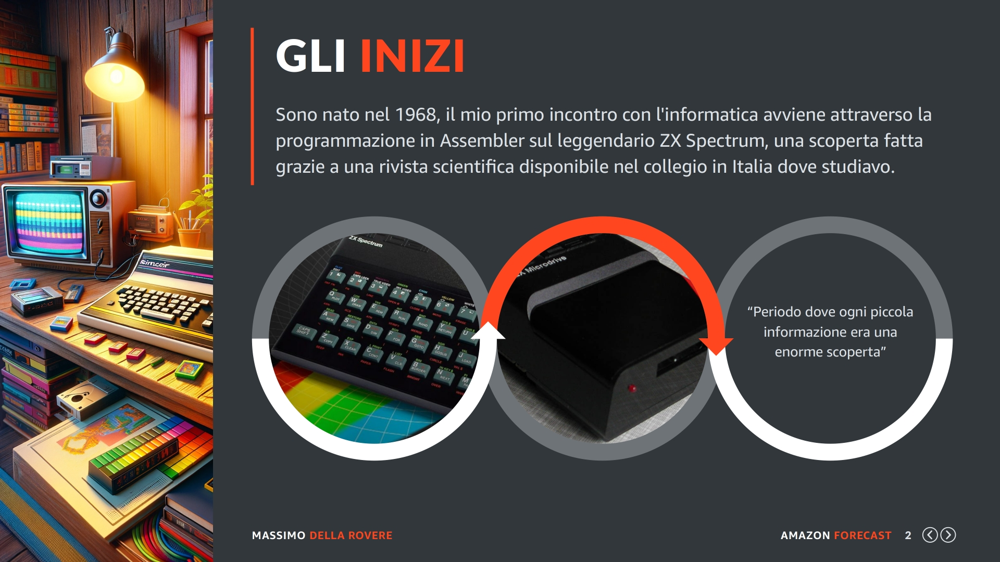
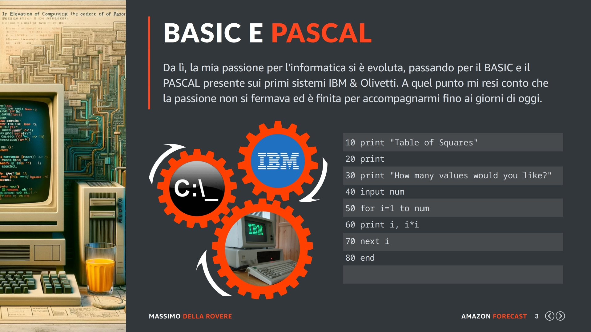
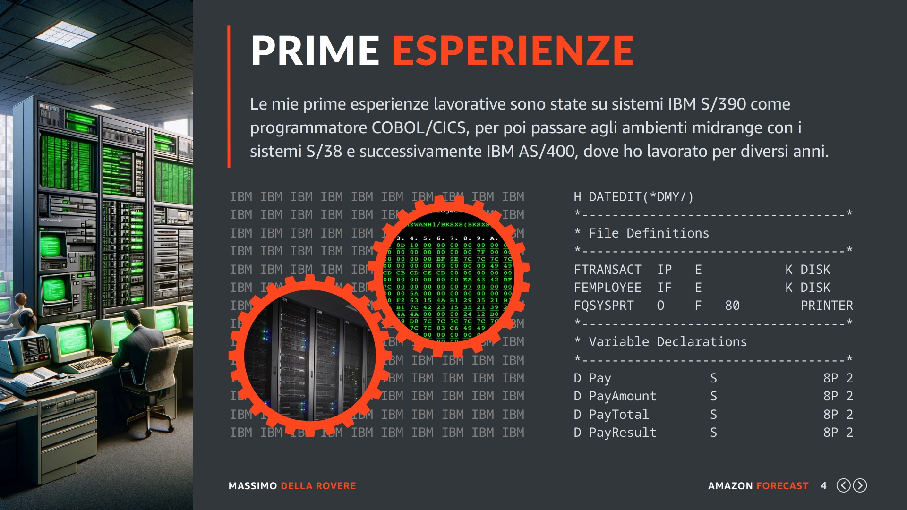
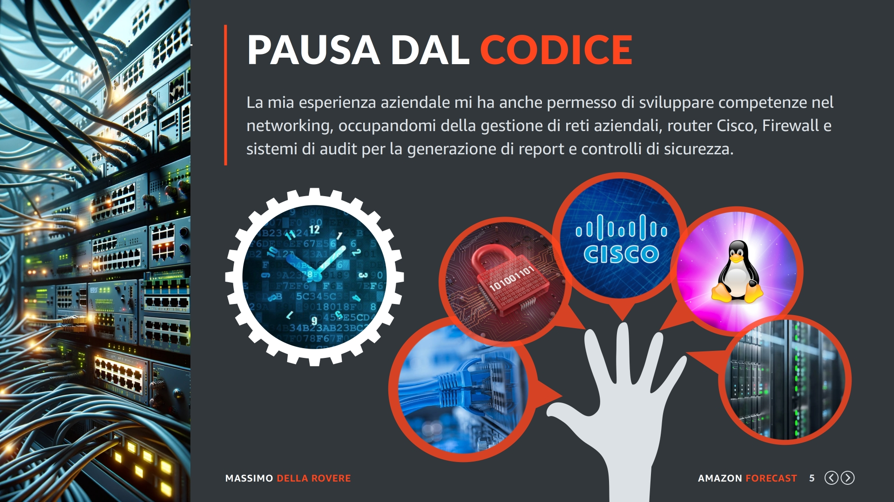
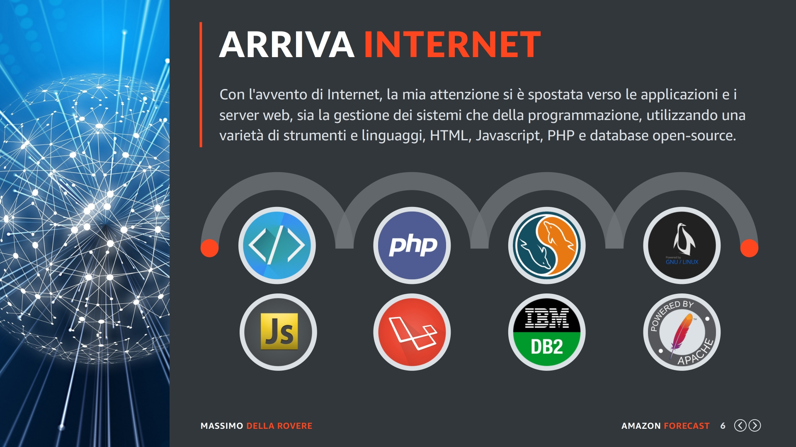
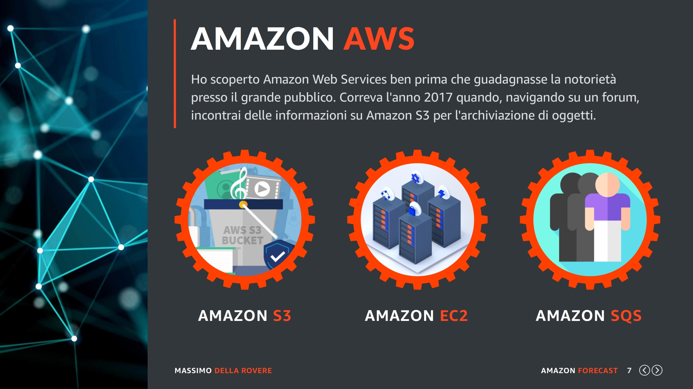
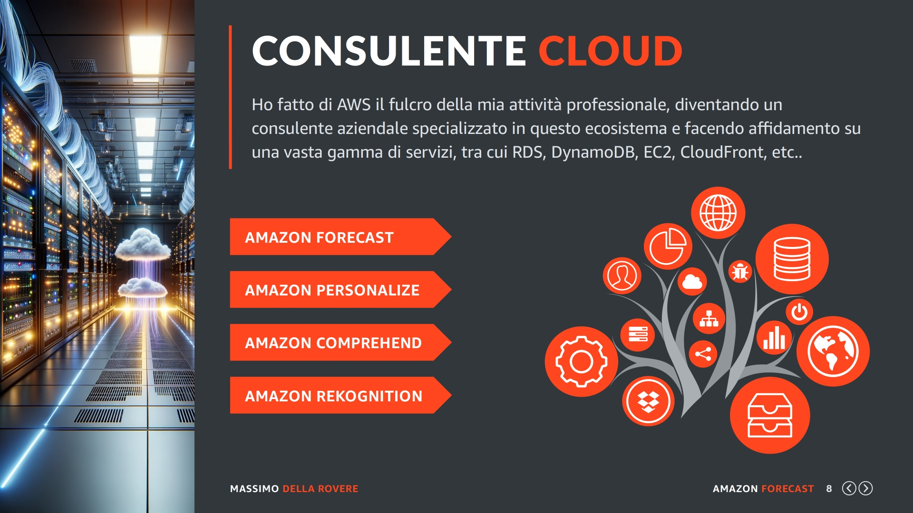

## Curriculum

Nelle edizioni precedenti dei miei corsi non ho mai riservato una slide alla mia storia professionale, una scelta che ha suscitato diversi commenti e richieste di chiarimenti da parte di alcuni studenti.
Quindi, ascoltato il feedback, ho deciso di condividere le mie esperienze in questo corso, senza però sottrarre troppo tempo prezioso. Se non vi interessa questo argomento sentitevi liberi di saltare direttamente al prossimo capitolo.

## Inizio

Sono nato nel 1968, il mio primo incontro con l'informatica avvenne attraverso la programmazione in Assembler sul leggendario ZX Spectrum, una scoperta fatta grazie a una rivista scientifica disponibile nel collegio dove studiavo in Italia.

## Basic

Da lì, la mia passione per l'informatica si è evoluta, passando per il BASIC e il PASCAL presente sui primi sistemi IBM & Olivetti. A quel punto mi resi conto che questa passione non terminava ed è finita per accompagnarmi fino ai giorni di oggi.

## Esperienze

Le mie prime esperienze lavorative nel campo dell'informatica sono state su sistemi IBM S/390 dove svolgevo la funzione di programmatore COBOL/CICS, per poi passare, solo dopo un anno, agli ambienti cosiddetti midrange come i sistemi IBM S/38 e successivamente IBM AS/400, dove ho lavorato per diversi anni.

Durante questo periodo, mi sono concentrato moltissimo sulle applicazioni aziendali, lavorando intensamente con il database DB/2 di IBM e i linguaggi di programmazione come RPG e COBOL.

## Pausa

La mia esperienza passata in gran parte in grandi aziende mi ha anche permesso di sviluppare competenze nel networking, occupandomi della configurazione e gestione di reti aziendali, router Cisco, firewall, e sistemi di audit per la generazione di report e controlli di sicurezza.
Diciamo che ho fatto una piccola pausa sull'aspetto della programmazione e giravo per l'italia andando ad installare router, proxy e reti di diverse tipologie.

## Internet

Con l'avvento di Internet, la mia attenzione è ritornata verso lo sviluppo delle applicazioni e i server web in generale, sia dal punto di vista della gestione dei sistemi che della programmazione, utilizzando una varietà di strumenti e linguaggi, tra cui HTML, Javascript, PHP, e database open-source come MYSQL.

Oggi, il mio interesse nella programmazione è focalizzato molto sui framework PHP come Laravel, Symphony e Zend, e utilizzo regolarmente Aurora, la soluzione MYSQL di Amazon. Dal punto di vista sistemistico, continuo a prediligere Linux e servizi web come Apache e NGINX ovviamente tutto in AWS.

## Amazon AWS

Ho scoperto gli Amazon Web Services ben prima che guadagnasse la notorietà presso il grande pubblico. Correva l'anno 2017 circa quando, navigando su un forum, incontrai delle informazioni sul servizio di Amazon S3 per l'archiviazione di oggetti e sul servizio di Amazon EC2, il quale prometteva di rivoluzionare il mondo dei server.

Queste informazioni accesero la mia curiosità, spingendomi a esplorare la documentazione ufficiale di AWS, dove scoprì anche l'esistenza di un terzo servizio, Amazon SQS. Sebbene oggi lo utilizzi quotidianamente, devo ammettere che all'inizio non ne compresi appieno l'utilità. Era veramente tutto una grande novità.

La mia prima esperienza con Amazon EC2 fu caratterizzata da una certa dose di confusione iniziale, ma nonostante le difficoltà, riuscii ad avviare la mia prima istanza e ad effettuare il primo accesso SSH da remoto. Il senso di soddisfazione per questo traguardo fu tale da spingermi a non abbandonare più i servizi AWS con cui tutt'oggi lavoro.

## Consulente

Da quel momento in poi, ho fatto di AWS il fulcro della mia attività professionale, diventando un consulente aziendale specializzato in questo ecosistema e facendo affidamento su una vasta gamma di servizi, tra cui RDS, DynamoDB, EC2, CloudFront, S3, QuickSight, Forecast, Pinpoint, Cloud9, WorkMail e molti altri.

Per quanto riguarda i servizi AI di Amazon al momento utilizzo:

    • Amazon Forecast
    • Amazon Personalize
    • Amazon Comprehend
    • Amazon Rekognition

Con questa panoramica spero di averti fornito un contesto utile sulla mia esperienza e sul percorso che mi ha portato fino a qui, dove cercherò di guidarti nell'apprendimento del servizio di Amazon Forecast e delle tecnologie cloud in generale.