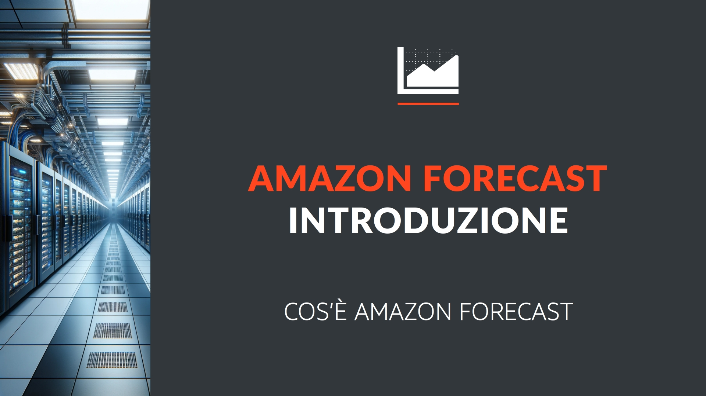
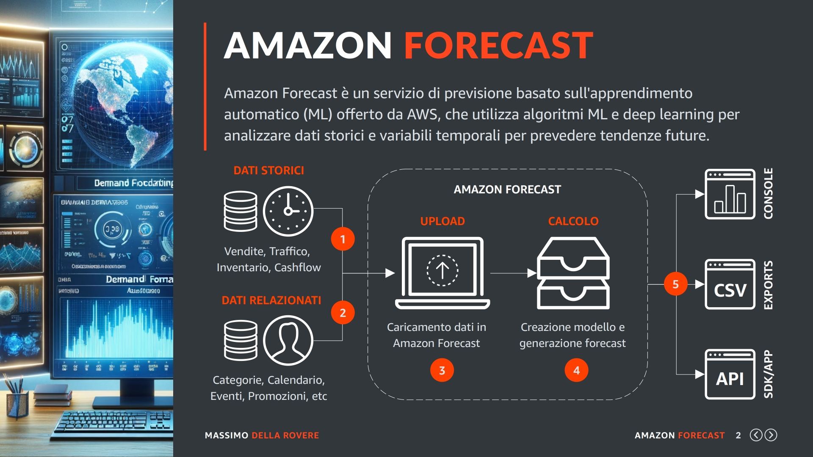
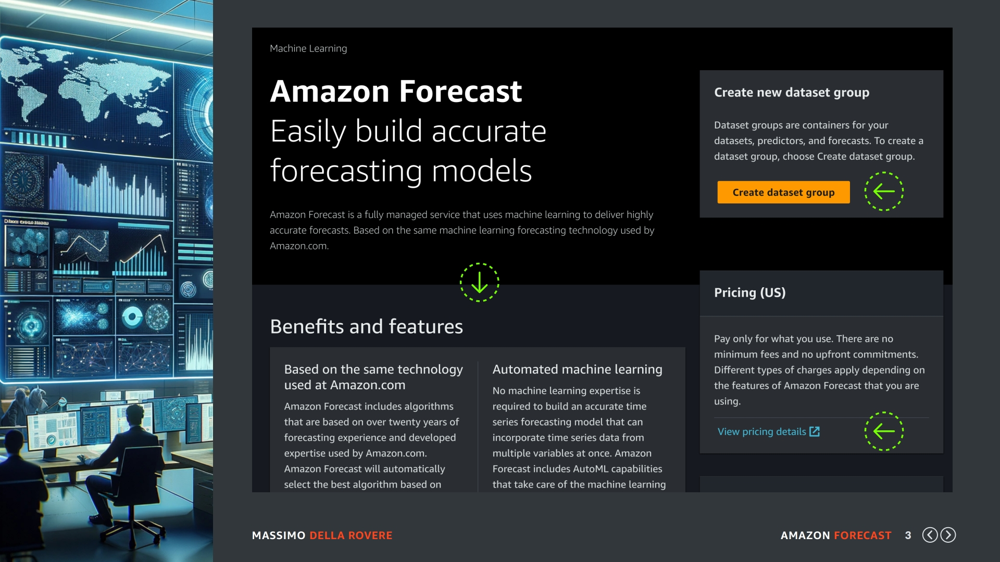
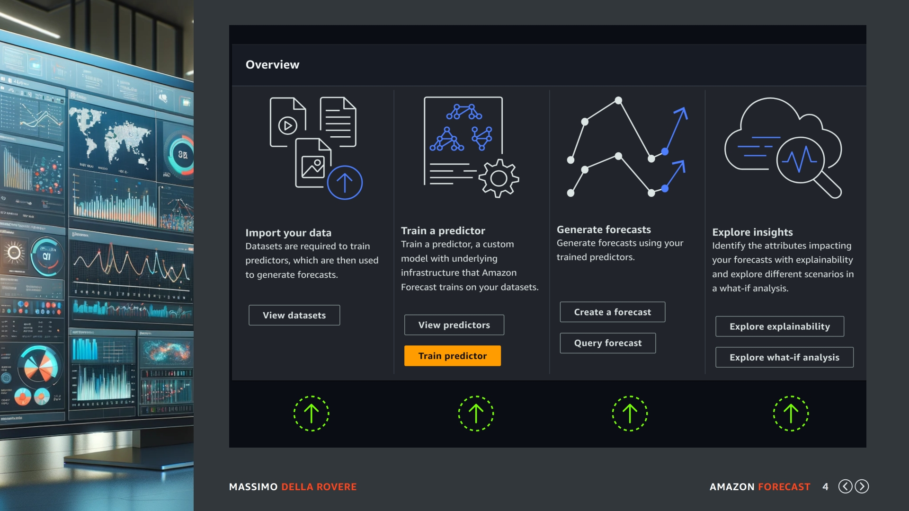
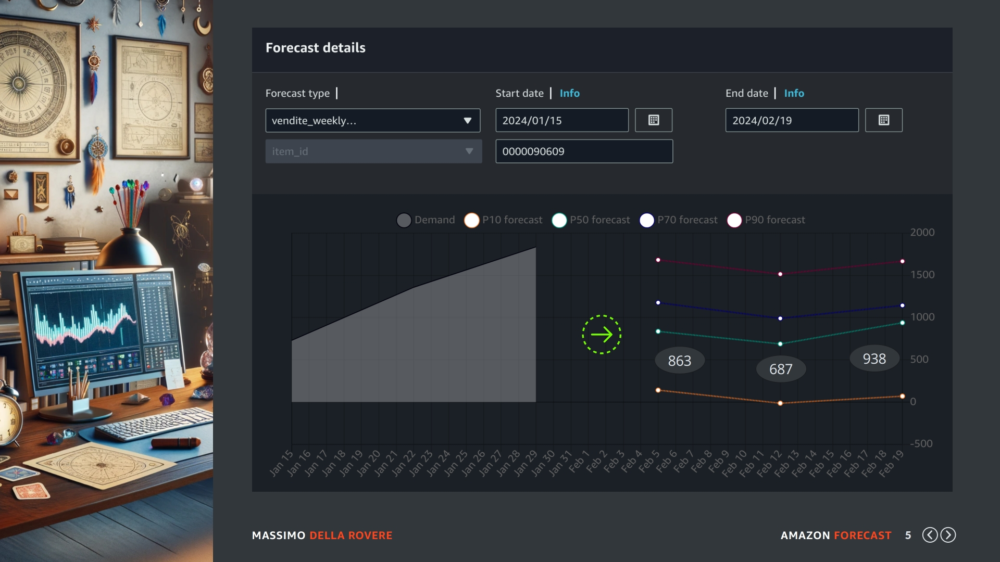
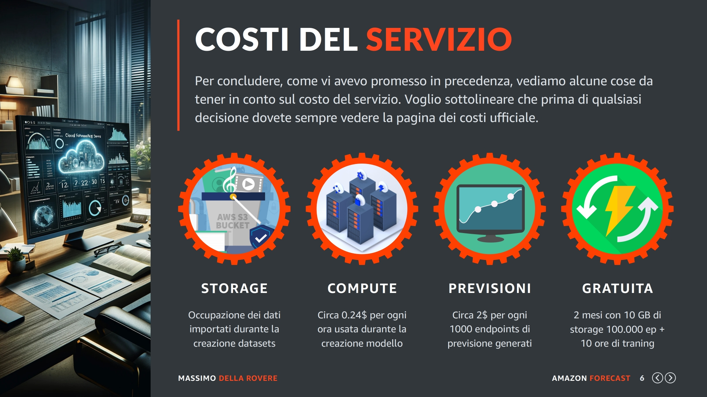

## Amazon Forecast

Benvenuti in questa nuova sezione dove andremo a presentare il servizio di Amazon Forecast, iniziando dalla sua definizione per passare poi ad analizzare le sue caratteristiche principali.

## Introduzione

Cos'è Amazon Forecast: Iniziamo dalla definizione standard:

Amazon Forecast è un servizio di previsione basato sull'apprendimento automatico (ML) che utilizza algoritmi di Machine e Deep learning per analizzare dati storici temporali e prevedere tendenze future.

Forecast può essere impiegato in vari settori, come retail, finanza, produzione, previsione della domanda, pianificazione delle risorse, ottimizzazione delle scorte, e molto altro.

Ok adesso che abbiamo fatto il nostro compitino con la definizione vediamolo con uno schema grafico.

Questo schema che vi ho preparato cerca di racchiudere le operazioni fondamentali che si devono eseguire per ottenere e usare le previsioni. La prima cosa (nella parte sinistra di questo schema) è quella di avere i dati storici da analizzare, come vedete in entrata abbiamo due tipi di dati:

**(1) Dati storici**

Sono gli unici dati obbligatori alla previsione e contengono la serie temporale + il valore da prevedere che normalmente viene chiamato "demand", ad esempio questo valore può contenere le vendite di un prodotto. 

**(2) Dati relazionati**

Sono dei dati che contengono informazioni aggiuntive il cui scopo è quello di migliorare la previsione. Ad esempio le categorie di appartenenza del prodotto, il prezzo medio di vendita in un determinato periodo, etc etc. Non vi preoccupate che vedremo questo aspetto più dettagliatamente durante il corso.

Una volta che abbiamo a disposizione questi dati in un file CSV possiamo eseguire la prima operazione presente nel servizio di Amazon Forecast e cioè eseguire l'upload dei dati nel servizio stesso. 
Operazione indicata nel punto 3 dello schema e racchiuso nella zona del servizio di Forecast.

Una volta che i "dataset" sono stati caricati, il servizio è pronto per creare il suo primo modello (chiamato predictor e indicato nel punto 4 di questo schema) e successivamente creare le previsioni dei prodotti che indicheremo in un file CSV separato (conosciute come forecasts). 

Una volta che Amazon Forecast ha completato tutto il suo lavoro, creazione del modello e creazione dei forecast, noi possiamo interrogare le previsioni in diverse maniere.

Come possiamo vedere sulla destra dello schema e indicato come punto 5.

La prima che è la più semplice in assoluto è quella di indicare il codice prodotto (item_id nel nostro caso) nella console AWS e vedere il grafico delle previsioni. Questo è un ottimo strumento per fare dei controlli e delle prove in generale durante lo sviluppo dell'applicazione previsionale. 

Il secondo metodo è quello di richiedere una esportazione completa delle previsioni su un bucket di Amazon S3 che può essere usato per essere importato nel vostro applicativo centrale o semplicemente aprirlo con Excel ed eseguire le dovute analisi con delle formule di calcolo personalizzate ed estrazioni aggiuntive.

Il terzo metodo quello un pochino più complesso è quello di usare delle chiamata API per identificare le risorse, la dimensione e il periodo di previsione che vogliamo analizzare e con il quale verrà restituito al vostro programma una struttura dati in formato JSON.

Quindi ricapitolando tutto il concetto da capo:

- Prepariamo i dati storici presenti nel nostro database.
- Prepariamo i dati relazionati presenti sempre nel nostro database.
- Eseguiamo la funzione di import in Amazon Forecast.
- Creiamo il nostro predictor e generiamo le previsioni (forecasts).
- Interroghiamo le previsioni tramite console o tramite programmi e integrazioni API.

Questo è in maniera molto semplice l'intero processo del servizio di previsione.

## Dashboard

Ok, andiamo a curiosare nelle pagine del servizio di Amazon Forecast messe a disposizione da AWS. Quindi per prima cosa, come sempre indicato, dovete avere un account valido in AWS e avere i permessi specifici per utilizzare il servizio.

Una volta dentro la console scegliete la regione geografica su cui volete lavorare e cercate nella barra di ricerca dei servizi il termine Amazon Forecast. Dovreste atterrare su questa pagina: 

La prima cosa che osserviamo è l'interfaccia del servizio, al momento è ancora solo in inglese, selezionando italiano o spagnolo che sono le mie lingue non viene tradotto, quindi ci sarà da aspettare ancora un po' o magari voi mentre state guardando questo video avete già la traduzione disponibile nella vostra lingua.

In ogni caso, a parte leggere i benefici e le caratteristiche del servizio indicati dalla prima freccia verde, ci sono due punti che vale la pena dargli attenzione e il primo è il link dei prezzi.

Dopo più di 10 anni di esperienza con AWS vi consiglio caldamente prima di usare qualsiasi servizio di Amazon di leggere attentamente la pagina dei prezzi, che non a caso vi indicano con un link ben chiaro. In ogni caso spenderemo due parole su come si calcolano i prezzi in Amazon Forecast a seguire.

La seconda cosa da notare è che la prima operazione da eseguire è quella di creare un "dataset group", indicata dal pulsante giallo ben visibile. Sicuramente essendo la prima volta che usate il servizio non ne dovreste aver nessuno. Invece nel caso in cui ne avete già creato uno, il pulsante di creazione verrà sostituito con il bottone per vedere i gruppi esistenti.

Il dataset group non è altro che un contenitore logico in cui andiamo a memorizzare i nostri dati (chiamati dataset), tutti i modelli creati (chiamati predictor) e tutte le previsioni generate (chiamate forecast).

Per questo corso ho già un "dataset group" su cui creare previsioni su base settimanale delle vendite di diversi prodotti, quindi tutte le configurazioni dei dataset, l'aggregazione della linea del tempo, le features aggiuntive da usare durante la creazione del modello, etc si trovano tutte dentro un dataset group specifico.

Se devo usare delle configurazioni diverse o anche fare previsioni su campi "demand" diversi devo creare un'altro dataset group e gestire tutto dentro quest'ultimo. Inoltre ogni dataset group è legato ad un dominio di previsione, tipo RETAIL, WORK FORCE, INVENTORY etc etc

Non vi preoccupate se alcune cose possano non tornare chiare perché le vedremo successivamente.

## Dataset group

Una volta che create il primo "dataset group" la console AWS sarà simile alla schermata corrente, adesso è inutile che ne create uno per vedere questo risultato, tanto lo faremo insieme passo per passo.

Al momento io ho preso un dataset group che già esiste nel mio account per farvi vedere la coerenza tra il servizio e lo schema iniziale che vi avevo proposto.

Infatti qui vedete lo step iniziale a sinistra dove si può eseguire l'operazione di upload dei dati, il passo successivo è la creazione del "predictor" per la generazione di un modello con cui generare le previsioni, e il passo ancora successivo è quello di creare le previsioni sulle risorse selezionate, infatti non è necessario e ne obbligatorio fare le previsioni di tutti gli elementi presenti nel predictor, in poche parole noi possiamo avere migliaia di prodotti per allenare il modello ma generare le previsioni solo su 100 prodotti.

Una volta generate le previsioni avrete come nel mio caso anche il pulsante Query Forecast per controllare direttamente dalla console la previsione di una risorsa come ad esempio un codice prodotto

Poi abbiamo anche degli strumenti più avanzati per Analizzare le previsioni e creare delle regole What-If, giusto per darvi un accenno, prendiamo ad esempio che ho una previsione di un prodotto ma quanto cambierebbe se mettessi questo prodotto in offerta al 50%?

Adesso giusto per curiosare facciamo conto che abbiamo già eseguito il nostro upload, abbiamo creato il predictor y generato delle previsioni. A questo punto usiamo il bottone [Query forecast] e vediamo che informazioni possiamo ottenere rispetto ad un codice prodotto che ci interessa...

## Risultato

Eccoci qui, sto utilizzando dei dati reali per un miglior risultato o per lo meno più realistico. Ho indicato il codice del prodotto e il periodo della previsione. In questo caso le previsioni sono 3 e ognuna è creata su base settimanale, quindi ho per ogni prodotto 3 settimane di previsione. 

Ovviamente questa impostazione è personalizzabile, potete creare previsioni per più periodi di tempo e su basi temporali diverse, ad esempio 6 previsioni mensili, 3 previsioni annuali, 72 previsioni orarie etc etc..

La previsioni sono le linee alla destra di questo grafico, come potete notare non ho solo una previsione, in quanto come vedremo più tardi nel corso sono stati usati diversi percentili. Il cliente in questione ad esempio usa i percentili 10 e 90 per le previsioni minime e massime, mentre i percentili 50 e 70 sono usati per l'operazione di riordino a fornitore in automatico.

Sia se questo concetto è già di tuo conoscimento o no, adesso non è importante, in quanto comunque lo affronteremo più in là. Adesso concentriamoci sul percentile 50 (la riga verde) e supponiamo che abbiamo solo questa previsione e che siamo a fine gennaio 2024. Il servizio di Forecast ci sta dicendo che secondo la sua previsione il prodotto selezionato avrà una vendita di:

- 836 unità dal 05.02.2024 al 11.02.2024
- 687 unità dal 12.02.2024 al 18.02.2024
- 938 unità dal 19.02.2024 al 25.02.2024

Quindi adesso che abbiamo questi dati cosa possiamo farci? Be, un esempio potrebbe essere quello di calcolare le vendite delle prossime due settimane fare la differenza con lo stock attuale per sapere lo stock mancante ed eseguire un ordine a fornitore per coprire le vendite delle prossime 2/3 settimane a secondo dei casi specifici. Ma come scoprirete da soli le decisioni che si possono prendere sono moltissime e tutte molto interessanti dal punto di vista aziendale.

## Costi

Per concludere, come vi avevo promesso in precedenza, vediamo alcune cose da tener in conto sul costo del servizio. Voglio sottolineare che prima di qualsiasi decisione dovete sempre vedere la pagina dei costi ufficiale e non basarvi su quello che sto indicando io in questo momento, in quanto le cose possono cambiare con il tempo o magari voi avete bisogno di alcune feature che io in questo momento non ho preso in considerazione.

Quindi prendete questa sezione come solo informativa e non ufficialmente valida per il calcolo dei costi dei servizi che andrete ad utilizzare una volta iscritti agli Amazon Web Services.

Detto questo: Io dividerei i costi in tre gruppi Storage, Computazione e Previsioni. Aggiungendo anche che al momento di questo corso esiste una prova gratuita di due mesi per fare le prime prove e valutare il servizio senza fare investimenti economici.

Comunque: Il primo costo è lo storage occupato dalle operazione di upload, si paga circa 0,088 USD a GB, in ogni caso è il costo minore del servizio, io sinceramente non sono mai arrivato a spendere cifre molto significative, a differenza della generazione dei forecasts dove si può spendere parecchio specialmente se sono ripetute in tempi brevi.

Il secondo costo è il tempo di elaborazione del modello, il quale è molto difficile da calcolare a priori in quanto vengono provati diversi algoritmi, trovati quelli più idonei e in molti casi i dati vengono anche confrontati con i dataset di amazon come le (previsioni meteo) e Holiday (il calendario delle festività). In ogni caso stiamo circa sui 0.24 USD ogni ora di elaborazione richiesta dalla creazione del predictor.

Il terzo costo che molte volte è quello più significativo è di 2$ ogni 1.000 punti di previsione che come vedremo non coincide con il numero di prodotti, quindi si potrebbe pensare ho 10.000 prodotti e quindi avrò 10.000 previsioni da pagare.

Purtroppo i punti di previsioni da pagare sono la moltiplicazione dei periodi * i percentili, ad esempio nello schema precedente dove vi ho fatto vedere le previsioni di un codice prodotto dovremmo moltiplicare 3 (le settimane) per 5 ( i percentili) e otterremo 15 previsioni per ogni prodotto che trasformano i nostri 10.000 prodotti in 150.000 previsioni da pagare.

Una cosa importante che dovete controllare sulla documentazione ufficiale è che il costo dei 2 dollari per 1.000 punti di previsione in realtà non è fisso ma si abbassa man mano che si elaborano più endpoint. Quindi su grandissimi volumi di elaborazione i costi per ogni 1.000 previsioni possono essere molto più bassi dei 2 USD indicati.

In ogni caso proprio per darvi una idea, mi raccomando non fate assolutamente affidamento a questi valori per il vostro business, ma leggete la documentazione ufficiale di amazon.

Su un mio cliente che gestisce circa 15.000 prodotti con uno storico a livello settimanale di circa 5 anni, spendo mensilmente 1 USD di storage, 5 USD di training e 120 USD per la generazione delle previsioni su circa 4.000 prodotti, processo che ripeto circa ogni 3 settimane in modo da aggiornare le previsioni in base alle nuove vendite che nel frattempo si sono aggiunte al database.

Quindi il costo mensile (solo in questo caso) facendo le giuste medie approssimate è un po' più alto di 160 USD al mese. Ovviamente parliamo di un solo di tipo di previsione, infatti ogni "dataset group" avrà un suo costo basato sulle sue previsioni generate.

In ogni caso se volete fare solo delle prove potete usare il piano gratuito che vale per i primi due mesi da quando attivate il servizio, questo vi permette di eseguire un upload di 10 GB al mese, usare ogni mese 10 ore di elaborazione per la creazione del modello e generare fino a 100.000.