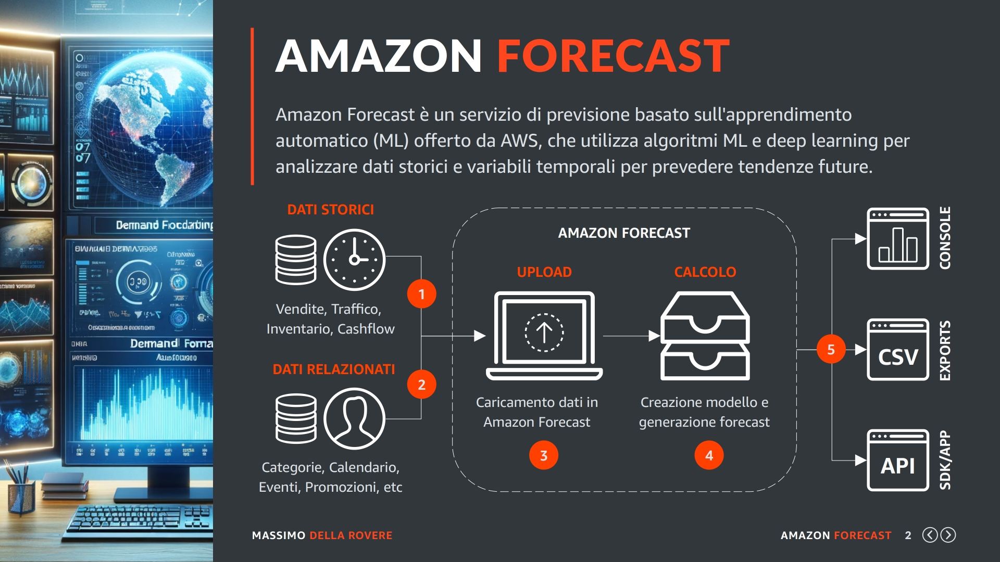
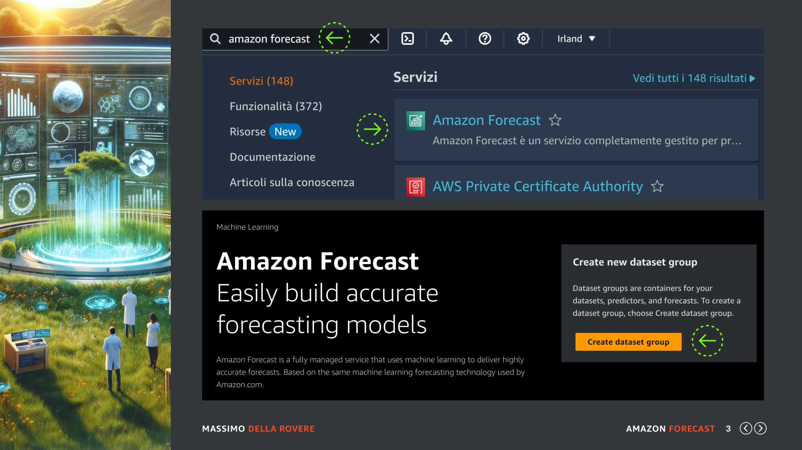
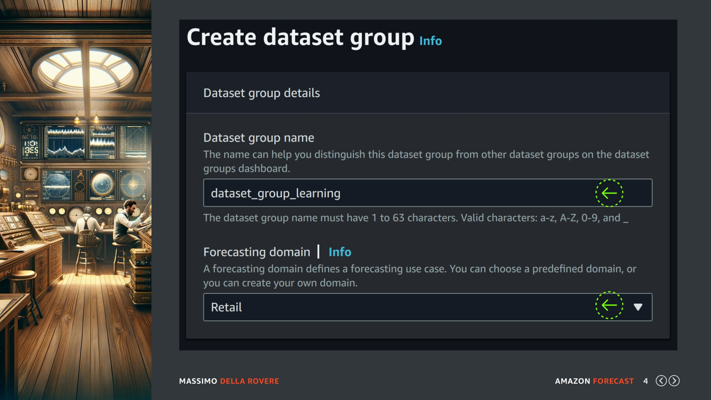
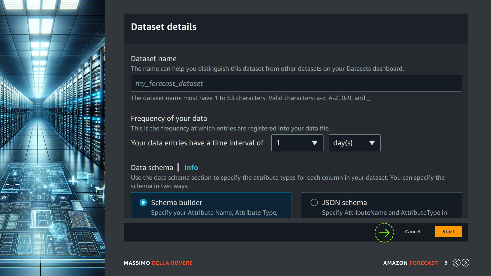
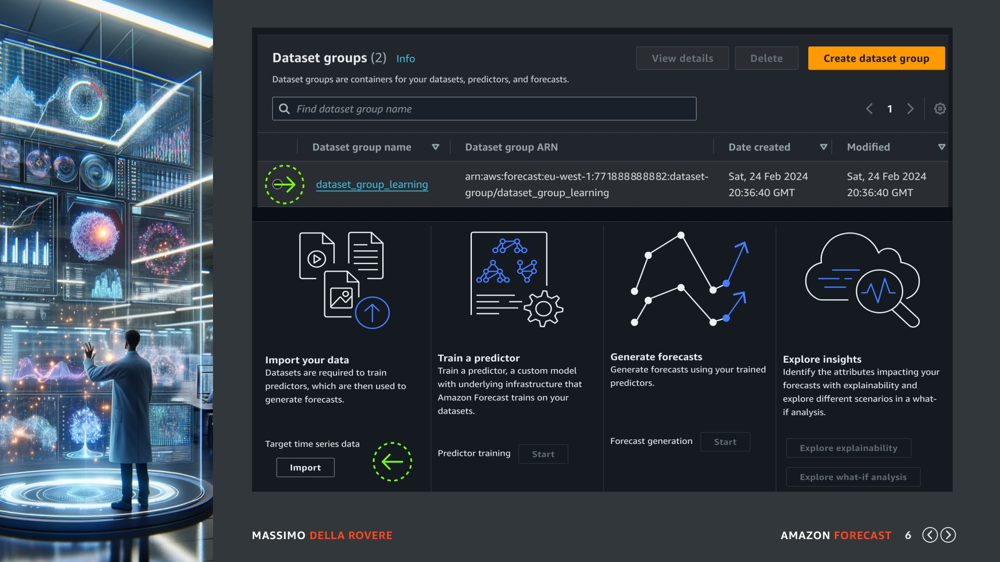
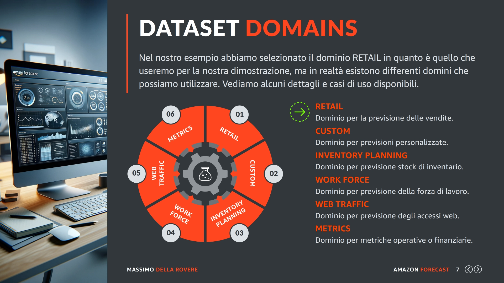

# Dataset

Benvenuti in questa nuova sezione del corso dove inizieremo a parlare di dataset, la prima risorsa indispensabile per ottenere le previsioni tramite il servizio di Amazon Forecast. Quindi iniziamo:

## Introduzione

Prima di passare alla prima operazione da eseguire in Amazon Forecast riguardiamo un minuto questo schema che vi ho presentato nelle lezioni precedenti.

Sulla sinistra abbiamo i dati da elaborare, al centro il caricamento dei dati nel servizio, la creazione del modello con la generazione delle previsioni e per ultimo sulla destra l'interrogazione delle previsioni.

In questa sezione del corso ci occuperemo della prima parte, cioè preparare i dati in base agli schemi richiesti ed eseguire l'upload di questi dati nel servizio di Amazon Forecast. Però prima di questo dobbiamo creare il contenitore di tutto il progetto che si chiama Dataset Group. Quindi passiamo a farlo:

## Ricerca

Per prima cosa selezionate la regione geografica dove avete deciso di lavorare, nel mio caso ho selezionato IRLANDA, cercate nella barra di ricerca il termine "amazon forecast" come indicato dalla prima freccia verde, vi dovrebbe apparire come primo risultato il link alla dashboard principale del servizio (seconda freccia verde) fate click su questa sezione e andiamo avanti. Una volta che siete nella dashboard (immagine in basso) selezionate il pulsante giallo per la "creazione di un nuovo dataset group".

## Creazione

Durante la creazione del dataset group vi verrà chiesto il nome della risorsa in questo caso ho indicato:

`dataset_group_learning`

Più in basso troviamo il nome del dominio predefinito, ci sono domini specifici e altri più generali, vedremo questo aspetto nelle slide successive al momento io seleziono RETAIL un domino specializzato nella previsioni di volumi di vendita futuri basandosi sulle vendite storiche suddivise per prodotto.

Adesso facciamo NEXT con il pulsante apposito per andare al passo successivo..

## Dettagli

In questa schermata ci viene chiesto di definire il dataset dei dati con cui eseguire un upload, infatti il dataset group che volevamo creare e già stato creato in quanto ha bisogno solo di un nome e di un dominio.

Però Amazon per farci risparmiare del tempo tende sempre a mettere in sequenza automatica alcune operazioni che logicamente sono separate, ho notato che questa tecnica per chi è agli inizi può creare un po' confusione.

Quindi ignoriamo questa richiesta e facciamo "CANCEL" perché il dataset group è stato già creato e andiamo a vedere insieme dove lo troviamo e cosa troviamo al suo interno.

## Schermata

Il dataset group appena creato lo troviamo nella lista dei dataset group presenti nel nostro profilo per la regione geografica selezionata. In questa slide lo troviamo in alto vicino alla freccia verde e si chiama "dataset_group_learning" se entriamo nel suo interno possiamo vedere le operazioni ammesse. 

Nel nostro caso come potete vedere dalla seconda freccia verde ci consente solo di eseguire un import dei dati, in quanto senza i dati ovviamente non si possono eseguire le operazioni successive come la creazione del modello o la generazione delle previsioni e tanto meno eseguire le funzioni di esplorazione.

Per questo motivo Amazon dopo che abbiamo creato il dataset group con il pulsante NEXT chiede subito di eseguire un upload, in quanto è la prima cosa obbligatoria che bisogna fare.

Però ho preferito farvi vedere le cose separate, per dare chiaramente l'idea che non è la stessa operazione. Il dataset group si può creare anche senza eseguire il primo upload. Quando si utilizzano le API per la gestione delle risorse questa concetto diventerà sicuramente più chiaro.

## Domini

Nel nostro esempio abbiamo selezionato il dominio RETAIL in quanto è quello che useremo per la nostra dimostrazione, ma in realtà esistono differenti domini che possiamo utilizzare.

Vediamo alcuni dettagli e casi d'uso disponibili.

- RETAIL: Uno dei domini più richiesti e viene utilizzato per la previsione delle vendite future.
- CUSTOM: Per previsioni personalizzate che non rientrano nei domini esistenti.
- INVENTORY PLANNING: Per previsioni di stock di materie e prodotti in base ai cicli di produzione.
- WORK FORCE: Per previsioni sulla forza di lavoro che si ha bisogno su specifiche attività.
- WEB TRAFFIC: Per le previsioni che riguardano gli accessi WEB al nostro sito.
- METRICS: Per le previsioni di metriche specifiche in ambito finanziario e operativo.

Ok adesso siamo pronti per passare alla creazione del nostro primo dataset di dati.

Grazie per partecipare a questo corso, ci vediamo alla prossima lezione.