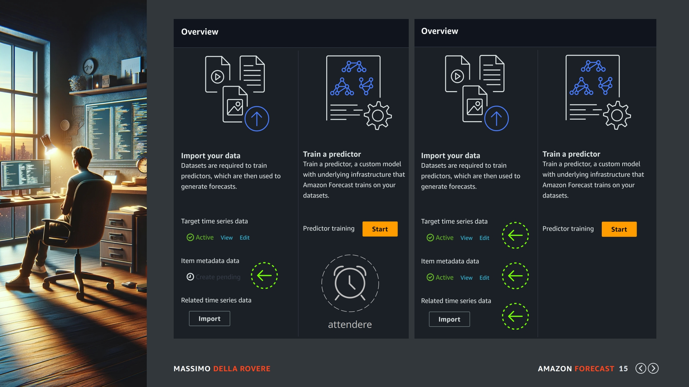

## Upload

Benvenuti in questa nuova lezione dove affronteremo la fase di upload dei dataset in nostro possesso secondo le specifiche che abbiamo indicato nelle lezioni precedenti. Iniziamo...

## Introduzione

Finalmente siamo alla prima fase del servizio di Amazon Forecast e cioè quella in cui eseguiamo un upload dei nostri dataset. Statisticamente parlando circa il 4% di voi avranno seguito il mio consiglio e preparato i loro dataset con cui eseguire questa operazione. Il 96% restante non avendolo fatto dovrà seguire il mio caricamento con miei dataset e rinunciare all'esperienza personale diretta tramite console AWS.

Questi sono i mie dataset: 

- Il TARGET_TIME_SERIES è chiamato dataset_target.csv occupa 212 MB con circa 9.200.000 righe
Contiene per ogni prodotto tutte le giornate che è stato venduto e il totale delle unità vendute.
- Il RELATED_TIME_SERIES è chiamato dataset_related.csv occupa 38 MB con circa 1.300.000 righe
Contiene per ogni prodotto tutte le settimane con i dati che hanno influenzato le vendite.
- Il ITEM_METADATA è un file chiamato dataset_metadata.csv occupa 321 KB con 10.929 righe
Contiene per ogni prodotto una riga con le informazioni anagrafiche da associare tra di loro.

Anche voi fate la stessa cosa e preparate sempre uno schemino simile, vi consiglio di prendere questa abitudine prima del caricamento per verificare che i dati siamo quelli aspettati, specialmente le prime volte per fare un calcolo dei prezzi in base alle previsioni che andrete a generare.

**ADESSO ANALIZZIAMO IL TUTTO**

Tutti e 3 i file devono essere memorizzati in un bucket S3 per importarli con la funzione standard di Amazon Forecast. Usate il formato CSV anche se è permesso il formato PARQUET.

Detto questo vediamo alcune curiosità. Il terzo dataset ha 10.929 righe quindi se avete studiato bene i dataset e avete seguito il mio consiglio di prepararli sapete benissimo che questo numero rappresenta il numero totale degli articoli che sono stati analizzati e su cui si sono creati i record di vendita.

Quindi il nostro ambiente di previsione è composto da 10.929 prodotti differenti.

Nel primo dataset il TARGET_TIME_SERIES abbiamo circa 9.200.000 record che non sono altro che tutte le righe giornaliere delle vendite di ogni singolo prodotto dei 10.929 indicati prima.

Avremo prodotti con più di 1000 giornate di storico e prodotti più nuovi magari con pochissime giornate di vendita. Il totale di queste righe sono circa 9.200.000 che saranno la base per la creazione del modello.

Nel mio caso sono 3 anni di storico.

Nel secondo dataset abbiamo lo stesso dato, ogni prodotto indicherà per ogni settimana le variabili che hanno inciso sulla vendita, prezzo, offerta, stock etc.. Le righe sono 1.300.000 per un totale di 38 MB.

## Datasets

Questo è un esempio dei miei dataset anche se c'e ne sono di più per delle funzioni più avanzate, pero' ci sono quelli che abbiamo appena indicato.

Nell'immagine in alto i dataset sono processati e memorizzati su un server applicativo che accede al database e crea le aggregazioni.

Una volta che i dataset sono pronti saranno spediti su un bucket di Amazon S3 in modo che possano essere caricati su Amazon Forecast.

## Permessi

Se già usate i servizi AWS sapete bene che la sicurezza è presa molto seriamente da Amazon e ogni volta che usiamo un servizio dobbiamo essere sicuri di creare le risorse con le giuste autorizzazioni.

Molte volte non è sufficiente avere le autorizzazioni a livello di account in quanto tutti i servizi che svolgono operazioni in background come importazioni, backup etc devono usare dei ruoli assegnati i quali devono specificare le autorizzazioni specifiche alle risorse utilizzate.

Anche Amazon Forecast segue questa caratteristica e quindi bisogna creare un Ruolo che abbia le autorizzazioni giuste per eseguire ad esempio una operazione di upload, quindi avere le autorizzazioni sul bucket S3 in cui si troveranno i dataset e poter eseguire l'assunzione del ruolo da parte del servizio.

Purtroppo non posso entrare nei dettagli di Amazon IAM anche perché servirebbe un corso solo per questo forse anche più complesso di Amazon Forecast. Pero' vi posso elencare i passi per creare un Ruolo. Quindi andate in IAM dove troverete nel menu di sinistra la sezione dei Ruoli subito dopo quelle degli utenti.

## Ruolo

Selezionatela e cliccate su "Creazione Ruolo" e come vedete da questa slide scegliete come tipo di Ruolo il Servizio AWS (AWS service) (prima freccia verde) e più in basso Forecast come Nome del Servizio. Lasciate spuntate anche la opzione sottostante che indica di permettere l'accesso di Forecast ad Amazon S3.

Cliccate sul pulsante NEXT per andare al passo successivo:

## Policies

La policy AmazonS3FullAccess viene aggiunta in automatico dato che abbiamo flaggato l'opzione precedente sulle autorizzazione di Amazon S3. Andiamo avanti:

Indicate un Nome al Ruolo (ad esempio AmazonForecast-ExecutionRole) e se volete anche una descrizione del ruolo, a questo punto confermate la creazione del ruolo che useremo nelle slide successive.

Giusto per essere preciso anche se in questo momento non è così importante, il Ruolo creato è molto permissivo su S3 in quanto ha l'autorizzazione di lettura su tutti i bucket dell'account, in futuro quando dovete andare in ambiente di produzione limitate questo permesso solo al bucket interessato.

## Controllo

Ok adesso eseguiamo il primo UPLOAD del dataset TARGET_TIME_SERIES, vi ripropongo questa schermata dove dopo la creazione del dataset group avevamo notato che tutte le opzioni erano disabilitate in quanto bisognava prima di tutto eseguire l'upload di questi dati..

Quindi entriamo nel dataset group e clicchiamo sul pulsante IMPORT.

## Target

Per prima cosa ci viene chiesto il nome del dataset, io ho indicato dataset_target.

Come secondo valore ci viene chiesta la Frequenza, nel mio caso, come ho diverse volte indicato, sono su base giornaliera quindi scegliendo questa opzione che vedete sulla slide in modo che Amazon Forecast saprà che la data indicata nel mio file è un singolo giorno.

Se voi per caso avete creato un dataset con una Frequenza diversa specificate qui il valore corretto.

## Target Schema

A seguire ci viene chiesto di indicare lo schema che nel nostro caso è abbastanza semplice in quanto usiamo lo schema standard e quindi i campi sono già preimpostati.

La unica cosa che dovete ricordare è di cambiare il formato della data che essendo una data senza indicazione di orario, deve essere selezionata l'opzione che vedete nella seconda freccia verde.

## Target dettagli

A seguire dobbiamo indicare i valori del JOB di importazione, dobbiamo indicare un nome di lavoro, questo deve essere univoco non si può usare sempre lo stesso nome per tutte le importazioni.

Poi abbiamo il file type di importazione che nel nostro caso è CSV e quindi possiamo lasciare il valore di default. Però nulla vi vieta di usare il formato PARQUET se decidete di creare i dataset con questo formato.

Il prossimo parametro è il percorso del file TARGET_TIME_SERIES sul vostro bucket S3, se non lo conoscete a memoria usate il pulsante "Browse S3" navigate tra i vostri bucket e le cartelle in esso contenute. 

L'ultimo parametro da indicare è il Ruolo, quel famoso ruolo che abbiamo creato all'inizio di questa lezione, il quale dovrebbe concedere le autorizzazioni necessarie ad Amazon Forecast per leggere i nostri dati su S3.

OK adesso possiamo fare START tramite il pulsante giallo messo a disposizione.

## Target Check

Una volta che abbiamo confermato l'operazione di upload saremo dirottati alla pagina precedente dove il pulsante di upload sarà sostituito con l'indicazione di upload in progress.. Freccia verde sulla sinistra.

Dobbiamo attendere qualche minuto, il tempo necessario dipende molto anche dalla quantità dei dati presenti del dataset. Armatevi di pazienza, queste funzionalità necessitano di tempo..

Una volta che il dataset è stato caricato come potete vedere nella parte destra della slide, il dataset verrà indicato come ATTIVO e si attiverà anche il pulsante per la creazione del modello (lo start in giallo). Questo perché come abbiamo già detto il primo dataset è già sufficiente per la creazione del modello, mentre gli altri due dataset servono solo per migliorare le previsioni ma non indispensabili per la loro creazione.

Pero dato che noi siamo bravi e ci piace fare le cose bene, continuiamo ad eseguire l'upload del seguente dataset che ci viene indicato come ITEM_METADATA. Quindi selezioniamo di nuovo il pulsante IMPORT.

## Metadata

Il primo parametro da indicare è il nome del dataset che nel nostro caso sarà dataset_metadata. Qui a differenza del primo dataset non ci viene chiesta la Frequenza, in quanto il METADATA non ha nessun timestamp e le informazioni sono a livello di singolo prodotto.

Qui dopo il nome.. troviamo lo schema che in questo caso dovrà essere compilato in quanto abbiamo aggiunti molti campi che non sono previsti in modo standard, quindi con il pulsante di "aggiunta attributi" dobbiamo indicare il nostro schema che abbiamo presentato nelle lezioni precedenti.

## Metadata attributi

Il mio dataset è composto secondo questo schema:

- `item_id` (di tipo string) sarebbe il codice del prodotto
- `brand` (di tipo string) sarebbe la marca del prodotto
- `line` (di tipo string) sarebbe la linea merceologica del prodotto
- `category` (di tipo string) sarebbe la categoria merceologica del prodotto
- `family` (di tipo string) sarebbe la famiglia merceologica del prodotto

Ovviamente se nella creazione del vostro dataset avete cambiato la logica dei campi o anche la loro sequenza indicate correttamente quelli presenti nel vostro dataset.

## Metadata dettagli

Ok siamo arrivati all'ultima schermata di parametri dove dobbiamo indicare i valore del JOB di importazione, che senza ripetermi sono gli stessi che abbiamo indicato nella prima importazione.

Quindi il nome del lavoro, il formato del file del nostro dataset che è in CSV, il percorso del bucket S3 dove è memorizzato il nostro dataset e il ruolo per assegnare le autorizzazione al servizio di Amazon Forecast.

Quindi fate di nuovo START e aspettiamo la fine dell'importazione.

## Metadata check

OK, saremo dirottati di nuovo sulla schermata che ormai conoscete benissimo e vedremo il secondo dataset in stato di upload progress... 

Aspettiamo anche questa volta qualche minuto fino a quando la schermata non sarà come quella indicata sulla destra di questa slide, dove avremmo due dataset in ACTIVE e il pulsante di IMPORT pronto per l'importazione dell'ultimo dataset che riguarda il RELATED_TIME_SERIES.

Clicchiamo su questo pulsante e andiamo ad eseguire il nostro ultimo UPLOAD.

## Related

Indichiamo come sempre il nome del dataset che nel nostro caso è dataset_related e la frequenza dei nostri dati che in questo caso noi selezioniamo il livello settimanale. In quanto l'aggregazione del nostro dataset RELATED è su base settimanale e non giornaliera come nel dataset TARGET_TIME_SERIES.

## Related Schema

Per quanto riguarda lo schema anche qui dobbiamo personalizzarlo secondo le nostre necessità, quindi aggiungere tutti i campi che abbiamo previsto quando abbiamo fatto le lezioni sulla preparazione dei dataset. Nel nostro caso abbiamo:

- `item_id` (di tipo string) che è il codice prodotto
- `timestamp` (di tipo timestamp) state attenti al formato che selezionate deve essere senza orario
- `price` (di tipo float) il prezzo medio del prodotto
- `discount` (di tipo integer) per la % di sconto applicata al prodotto

Ok controllate bene i valori immessi e andiamo all'ultima schermata prima dell'UPLOAD.

## Related dettagli

OK siamo arrivati all'ultima schermata di parametri dove dobbiamo indicare i valore del JOB di importazione, che senza ripetermi sono gli stessi che abbiamo indicato nella prima importazione.

Quindi il nome del lavoro, il formato del file del nostro dataset che è in CSV, il percorso del bucket S3 dove è memorizzato il nostro dataset e il ruolo per assegnare le autorizzazione al servizio di Amazon Forecast.

Quindi fate di nuovo START e aspettiamo la fine dell'importazione.

## Conclusione

A questo punto non avendo più dataset da importare saremo dirottati sulla pagina dei dataset dove vedremo in stato di progress il nostro ultimo dataset e in active gli altri due. (immagine superiore della slide)

Aspettiamo qualche minuto anche in questo caso e vedremo che la nostra schermata ci indicherà che tutti i dataset sono in stato di ACTIVE e quindi siamo pronti per la creazione del nostro modello.

Una volta che i dataset sono pronti date sempre un occhiata alle caratteristiche, entrando in ogni dataset possiamo vedere alcune informazioni che vi possono avvisare di anomalie sui dati caricati.

Andiamo alla prossima slide per farvi un esempio concreto:

## Overview

Qui siamo entrati nei dettagli del dataset RELATED, nell'immagine in alto vediamo le opzioni principali, tipo il nome del dataset, la frequenza (W sta per settimana) il formato di timestamp, lo stato in Active etc.

Nella sezione sottostante invece è interessante vedere il numero delle entrate diviso per attributo con alcuni dati statistici che specialmente nelle fasi di impostazione iniziale sono utili per capire se i dati sono corretti.

Ad esempio qui vediamo l'attributo Discount che è stato indicato su 1.359.553 righe però ha in totale solo 11 valori unici va da un minimo di 0 ad un massimo di 60.

La media è di un 4.8 e la deviazione standard è di 9.2. È interessante da notare che raggruppando gli sconti in range abbiamo ottenuto solo 11 valori diversi da associare ai cambi dei volumi di vendita. 

## Statistiche

Vediamo anche il dataset METADATA che ha l'attributo brand che ci indica che abbiamo 344 brand diversi su 10929 associazioni a prodotti. I valori massimi e minimi etc non ci sono in quanto è una stringa.

Da notare che sotto le caratteristiche degli attributi troverete anche lo schema assegnato al dataset, le prime volte controllate sempre perché se pensiamo di lavorare con uno schema e in realtà ne abbiamo definito uno diverso possiamo perdere tanto tempo a non capire i risultati e le analisi aggiuntive in explore.

## Summary

Dopo aver creato i dataset se volete un consiglio fate uno schemino come questo, vi ritornerà molto utile, oltretutto si può automatizzare molto facilmente in automatico alla fine degli upload tramite dei semplici programmi applicativi che chiamano le API di Amazon Forecast e creano un foglio EXCEL.

Può essere molto utile per avere una visione completa dei dati e capire se ci sono delle anomalie o tutto procede come ci si aspettava. Ad esempio posso vedere che Item_id come valore assoluto deve essere lo stesso su tutti i dataset elencati, che le linee processate sono 8 mentre le categorie sono 63.

Nel dataset RELATED posso sapere che a fronte di 1.359.000 righe ho solo 11 variazioni di sconto mentre per i prezzi le variazioni sono 441 etc etc..