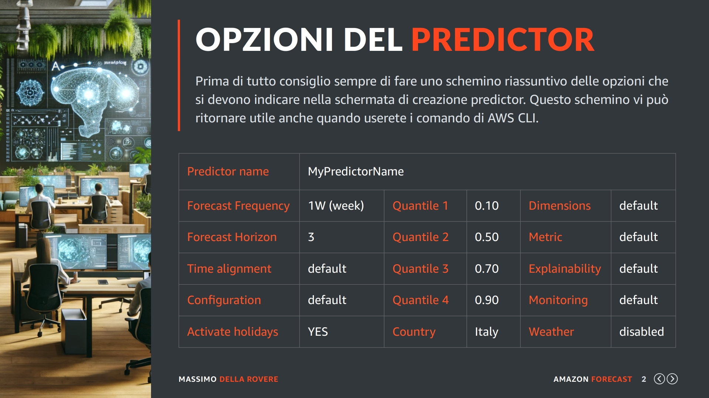
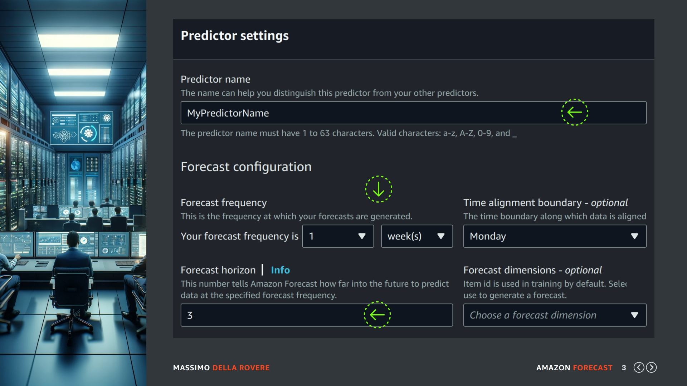
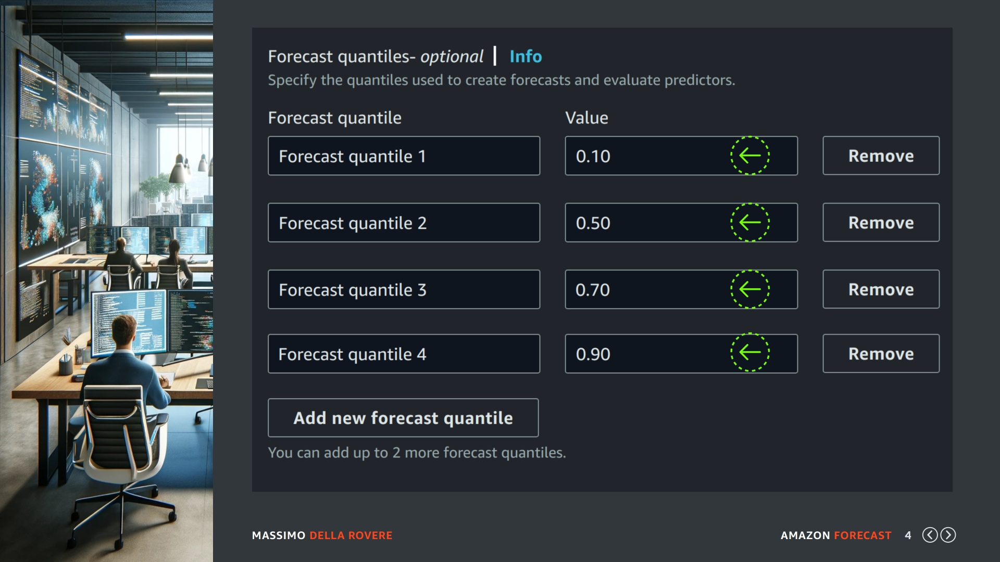
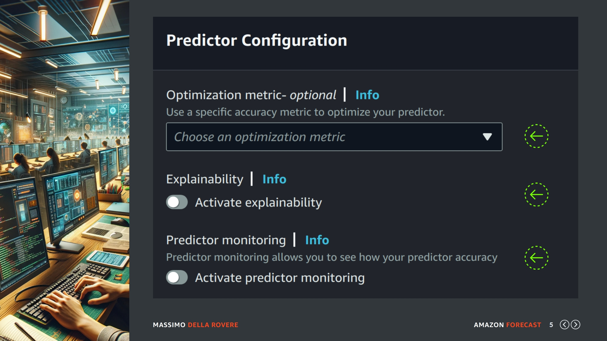
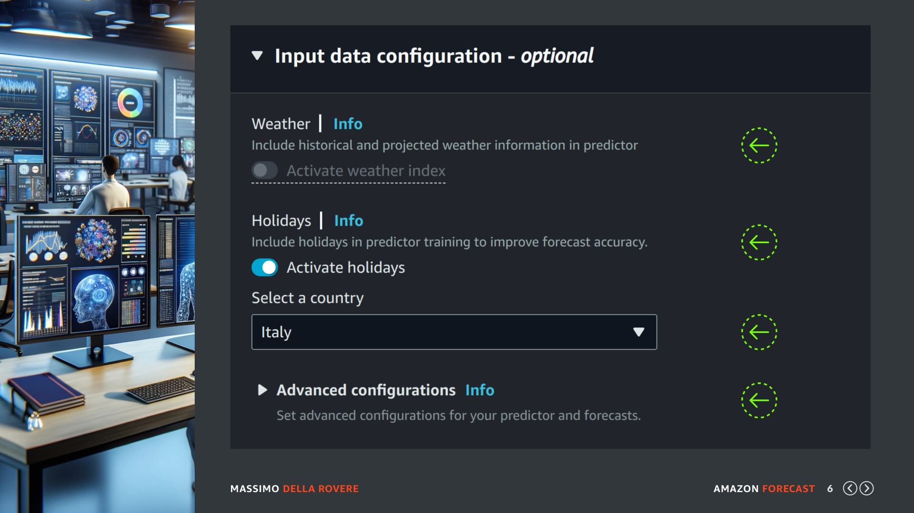
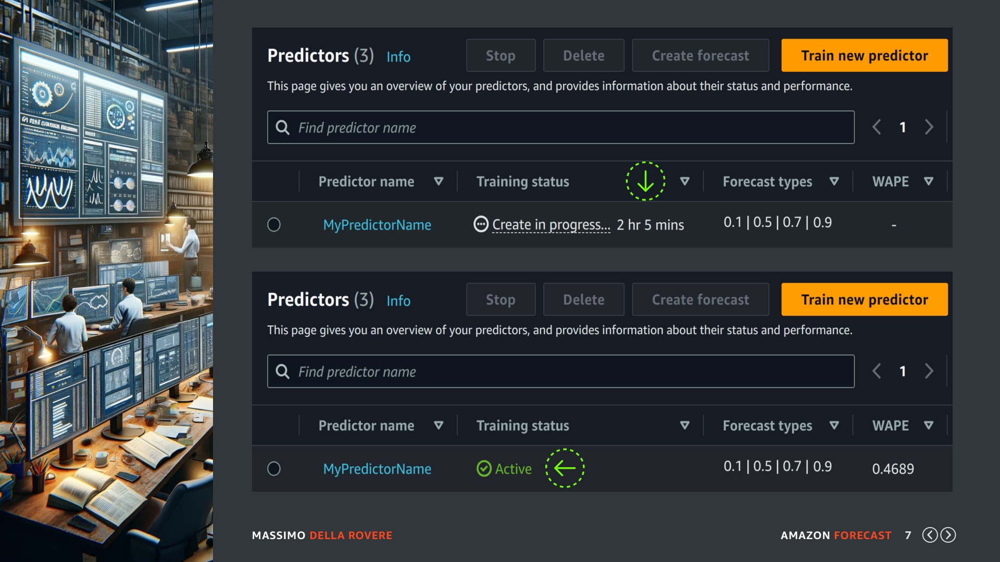

## (slide 1)

Benvenuti in questa nuova lezione in cui andremo a creare il nostro primo predictor in quanto nella lezione precedente abbiamo analizzato le opzioni che dovremmo indicare nella schermata di lancio.

## (slide 2)

Prima di tutto vi consiglio sempre di fare uno schemino riassuntivo delle opzioni che si devono indicare nella schermata di creazione del predictor. Questo schemino vi può ritornare utile anche quando userete i comandi di AWS CLI o un linguaggio di programmazione con SDK. Questi sono i valori scelti nel mio caso:

- nome del predictor = MyPredictorName
- frequenza = 1 settimana
- orizzonte = 3
- allineamento del tempo = lasciamo il valore di default
- configurazione predictor = lasciamo i valori di default 
- quantili ne useremo 4 = 0.10 0.50 0.70 e 0.90
- holidays = attiviamo questa opzione e specifichiamo italy in country
- tutte le altre opzioni al momento le lasciamo per default

OK, adesso che abbiamo stabiliti i valori delle opzioni lanciamo la creazione del predictor. 

## (slide 3)

Andiamo nel dataset group presente nel nostro account e selezioniamo il pulsante di creazione predictor, dovrebbe comparire questa schermata in cui vediamo il primo gruppo di opzioni disponibili, indichiamo il nome, la frequenza e l'orizzonte prestabiliti. Lasciamo gli altri valori di default.

Quindi nel mio caso come avevo indicato sul mio schemino, dopo il nome indico come frequenza una settimana e come orizzonte 3. Lascio per default tutti gli altri valori.

## (slide 4)

Nella slide corrente vediamo il secondo gruppo di opzioni che riguardano i quantili, anche qui aggiungiamo i valori prestabiliti, potete usare il tasto per aggiungere un nuovo quantile o per rimuoverne uno se per caso commette errori. Una volta indicati i quantili interessati scendiamo nella pagina per le opzioni successive.

Nel mio caso userò i quantili 0.10 0.50 0.70 e 0.90...

## (slide 5)

Questa è la sezione della configurazione del predictor e che come avevamo deciso la lasciamo di default al momento in quanto sono opzioni che ci servono quando iniziamo a conoscere bene cosa fa di preciso un predictor e vogliamo controllare il suo operato in modo più dettagliato con analisi specifiche.

Inoltre alcune opzioni hanno costi aggiuntivi. Quindi andiamo alla prossima slide.

## (slide 6)

In questa sezione invece troviamo le feature aggiunte di Amazon Forecast come il Weather e Holidays, in questo momento attiviamo solo la sezione Holidays e specifichiamo il valore "Italy" nel campo country. A questo punto non ci resta che confermare la creazione del predictor con il tasto giallo di conferma..

## (slide 7)

Una volta lanciata la creazione torniamo nel dataset group e richiediamo la lista dei predictor disponibili dove possiamo vedere come indicato nella parte superiore della slide (prima freccia verde) il predictor con una stima indicativa del tempo di elaborazione. 

Mi raccomando di osservare che le 2 ore e 5 minuti indicate è il tempo in cui il predictor sarà disponibile e no il tempo di elaborazione computazionale, il quale essendo processato con delle elaborazioni parallele potrebbe essere più alto. Quindi potremmo ad esempio ottenere il risultato in 2 ore ma pagare più di 10 ore. Tenete sempre sotto controllo questo aspetto.

Quando il predictor è pronto all'utilizzo e quindi utilizzabile per la generazione delle previsioni passerà in stato di "active" come potete vedere nella parte inferiore della slide.. (seconda freccia verde)