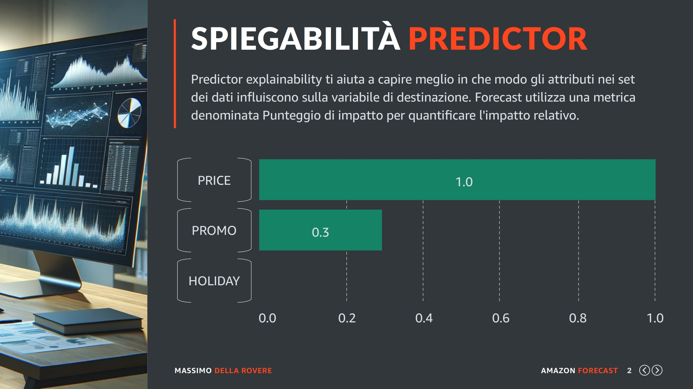
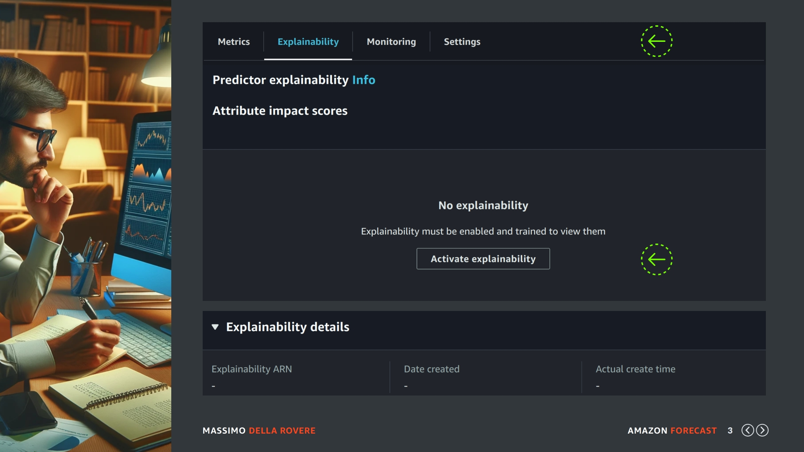
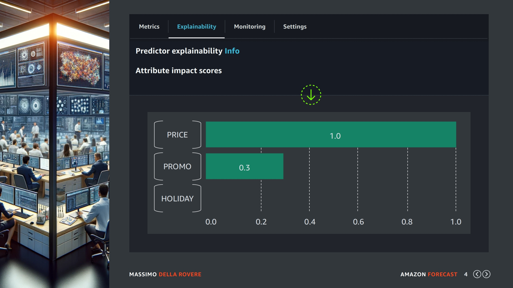
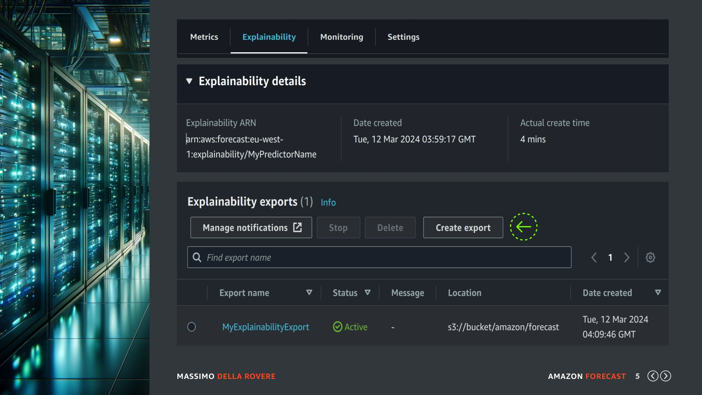
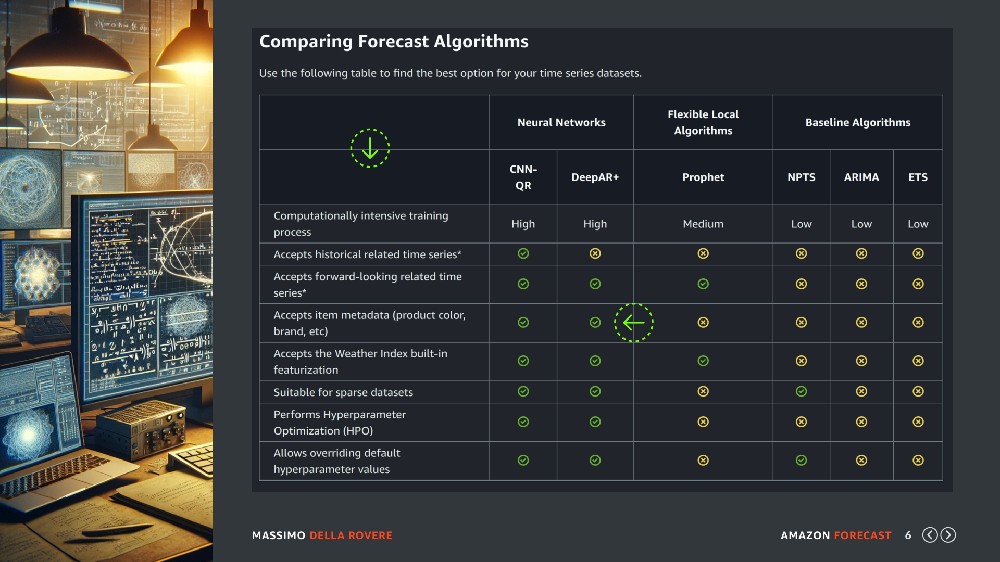
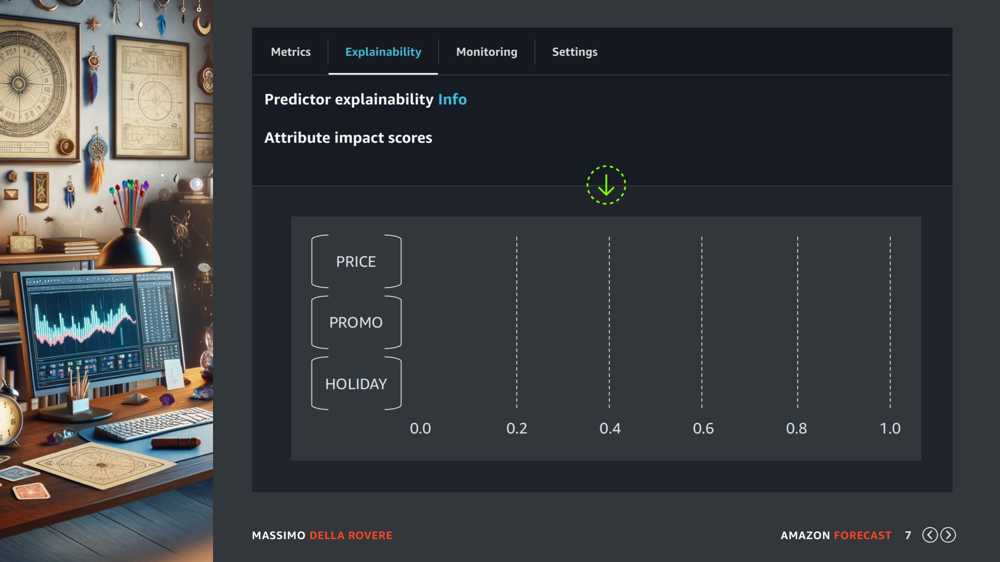

## (slide 1)

Nelle lezioni precedenti dopo avere creato il primo predictor abbiamo visto diversi aspetti che ci hanno aiutato a capire la struttura di un predictor e quali sono gli elementi che lo compongono e le risorse che vengono utilizzate per il suo funzionamento come gli algoritmi, le metriche e i backtest.

In questo lezione abbastanza breve aggiungerei una funzionalità relativamente nuova che è la spiegabilità del predictor che ci aiuta a capire quali sono i campi correlati che incidono di più sulla previsione.

## (slide 2)

Iniziamo come sempre dalla definizione ufficiale di Amazon: 

La spiegabilità di un predictor ti aiuta a capire meglio in che modo gli attributi dei dataset influiscono sulla variabile di destinazione (nel nostro caso le vendite).

Amazon Forecast utilizza una metrica denominata Punteggio di impatto per quantificare l'impatto relativo di ciascun attributo e determinare se aumentano o diminuiscono i valori di previsione.

Ad esempio, consideriamo uno scenario in cui il target èsalese ci sono due attributi correlati: price e promo. Le previsioni potrebbero scoprire che il prezzo di un articolo influisce in modo significativo sulle vendite (punteggio di impatto elevato), mentre la promo ha un effetto minore (basso punteggio di impatto).

In questo esempio il prezzo influenza le vendite senza ombra di dubbio mentre l'offerta ha un impatto minore e il calendario delle festività nessun impatto. Quindi in futuro se continuate ad avere questo risultato forse non servirebbe neanche usarlo e alleggerire la creazione del predictor.

## (slide 3)

Per attivare questa funzionalità andate nel dettaglio del predictor e selezionate in alto il TAB Explainability, in questa sezione viene visualizzato un grafico di tipo istogramma simile a quello che vi ho fatto vedere nella slide precedente. Però dato che in questo predictor la funzionalità non è attivata bisogna farlo cliccando sul pulsante di attivazione indicato dalla seconda freccia verde presente in questa slide.

Una cosa da sottolineare è che se usate la console AWS per attivare la spiegabilità del predictor potete farlo solo dopo aver lanciato la creazione del predictor e aspettato la fine di questa elaborazione. Mentre se create il predictor tramite API, AWS CLI o STEP Function potete specificare di farlo durante la creazione, cosi una volta che il predictor è disponibile ha già questa funzionalità attivata.

## (slide 4)

In questa schermata vediamo un grafico che viene visualizzato quando la funzionalità è attiva sia se sia stata attivata tramite API alla creazione del predictor o tramite console AWS in modo manuale. Una curiosità che vorrei aggiungere è che questi grafici vengono generati da Amazon Quicksight tramite dei componenti embed e per chi analizza i dati come lavoro è uno strumento sicuramente da studiare.

## (slide 5)

Come ormai avete avuto modo di apprendere... quasi tutte le funzionalità hanno una funzione di esportazione su Amazon S3 per la generazione di file CSV che possono essere analizzati con fogli EXCEL o integrati con il nostro applicativo per analisi specifiche nel caso in cui la quantità dei dati sia notevole.

Per eseguire una esportazione andate sempre nel predictor selezionato e dopo i dettagli troverete la sezione di exports dove potete creare una nuova richiesta di esportazione con il pulsante apposito indicato in questa slide con la freccia verde. Una volta che la richiesta è terminata e il lavoro di export passa in stato di active potete andare sul bucket S3 e scaricare i file generati.

## (slide 6)

Voglio concludere questa lezione riportandovi una informazione che sulla documentazione ufficiale al momento di questo corso non è indicata e dove io personalmente ho perso molto tempo prima di capirla.

Questa è la TABELLA degli algoritmi che vi avevo presentato nelle lezioni precedenti, come potete vedere i valori che la spiegabilità del predictor analizza sono quelli presenti nel dataset related e metadata, però queste informazioni sono analizzate sono quando vengono usati gli algoritmi CNN-QR e DeepAR+. 

Dalla mia esperienza ho visto che molte volte può capitare (specialmente quando i dataset non sono molto grandi e quindi non arrivano a milioni di righe) che questi algoritmi non vengono utilizzati e l'Autopredictor generi le previsioni con gli altri algoritmi dato che ottiene dei buoni risultati con le metriche.

## (slide 7)

In questi casi quando attiveremo la "spiegabilità" vedremo le metriche tutte a zero, infatti quando ho iniziato ad usare Amazon Forecast questa cosa mi faceva perdere molto tempo perché ero sicuro che avevo dei prodotti dove per forza lo sconto doveva incidere sul volume di vendita.

Alla fine sono riuscito a collegare che effettivamente dipendeva dall'algoritmo e se i miei dataset non avevano le caratteristiche giuste per attivare questi due algoritmi non avrei avuto il calcolo d'impatto sui valori correlati, e questo no perché lo sconto non aveva impatto sulle vendite ma semplicemente perché gli algoritmi utilizzati per le previsioni non ne tenevano conto.

Vi riporto questa esperienza perché se nel caso vi succede la stessa cosa non perderete tempo a capire il motivo e magari andare fuori strada pensando che i valori correlati non hanno impatto sul valore target. 