## (slide 1)

In questa lezione analizzeremo un'analisi interessante di Amazon Forecast che viene chiamata What-IF. Come abbiamo visto in precedenza possiamo generare previsioni in base ai nostri dati storici. La funzionalità di What-IF ci permette di poter aggiungere delle previsioni condizionali.

Ad esempio un prodotto con una previsione di vendita nella prossima settimana pari a 350 unità come potrebbe cambiare se il prezzo di vendita avesse uno sconto del 50%?

La funzionalità è molto interessante per diversi motivi, andiamo a vederla più in dettaglio.

## (slide 2)

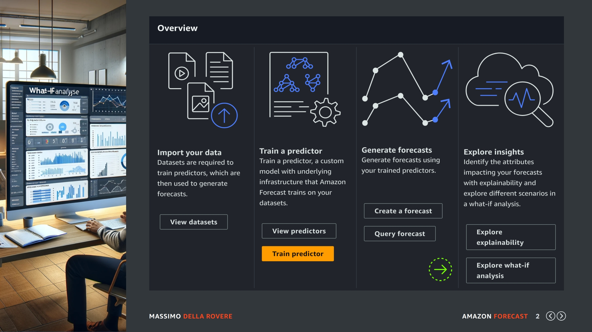

Per creare una nuova analisi What-IF possiamo sempre iniziare dal dataset group che ormai dovreste conoscere perfettamente. Diamo per scontato che nel dataset group ci sia un predictor e un forecast generato, in quanto quest'ultimo sarà la base della selezione per la creazione di una analisi What-IF.

Quindi selezioniamo l'opzione indicata dalla freccia verde di questa slide e andiamo al passo successivo.

## (slide 3)

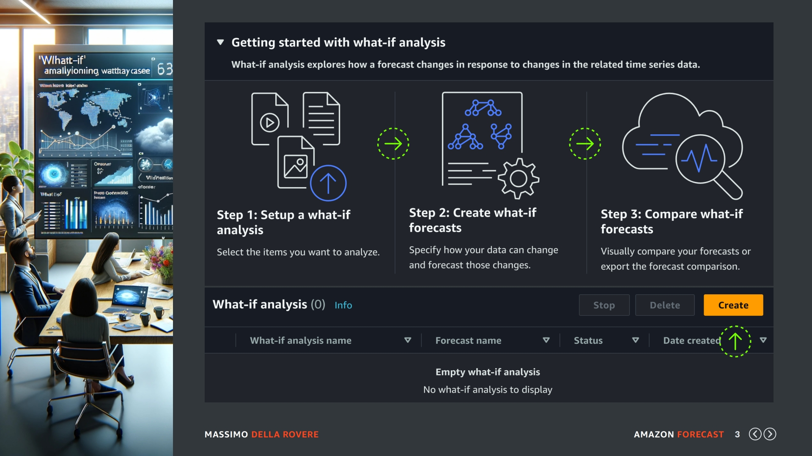

Prima di creare l'analisi, che potete eseguire cliccando nel tasto giallo di "creazione", fermiamoci a dare un po di attenzione allo schemino proposto nella pagina della funzionalità. I passi indicati sono:

- Step 1: Creazione di un'analisi What-IF. 
- Step 2: Creazione di un forecast What-IF .
- Step 3: Comparazione dei forecast What-IF. 

Per creazione di un'analisi What-IF si intende creare una risorsa che filtra tutte o una parte delle previsioni presenti in un Forecast. Quindi con l'analisi What-IF nel nostro caso non facciamo altro che dire quali sono le previsioni presenti nel forecast che ci interessano e che vogliamo mettere sotto test What-IF.

Per creazione di un forecast What-IF si intende creare delle regole di ipotesi per i prodotti che sono all'interno dell'analisi What-IF, tipo applicare un sconto del 50% ai prodotti presenti nell'analisi o aumentare lo stock di base del 30%.

Per comparazione di un forecast What-IF si intende la possibilità di mettere a confronto le varie ipotesi e avere le previsioni di base più le previsioni generate tramite le ipotesi indicate.

Facciamo un esempio pratico per chiarire meglio il concetto:

## (slide 4)

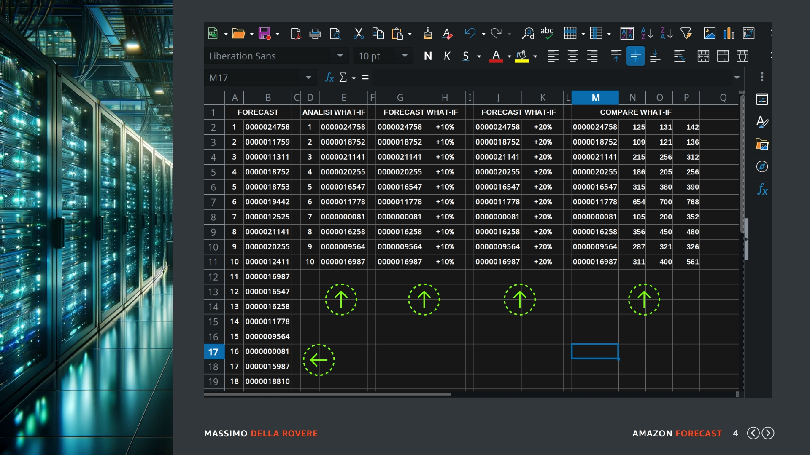

In questo foglio elettronico abbiamo sulle prime colonne gli Item_id del nostro Forecast diciamo con 1000 previsioni generate a livello di prodotto. Quando creiamo la analisi What-IF dobbiamo filtrare questo elenco e specificare in un file quali sono gli Item che vogliamo mettere sotto analisi. Quindi diciamo 10.

A questi 10 elementi specificati nelle colonne ANALISI WHAT-IF possiamo applicare dei forecast What-IF, in questo esempio ne facciamo due, uno simulando uno sconto del 10% e l'altro uno sconto del 20%. 

A questo punto possiamo usare la funzionalità di comparazione che ci dirà per ogni item_id presente nell'analisi What-IF la previsione di vendita normale, quella con il 10% di sconto e quella con il 20%.

OK adesso passiamo a generare un'analisi What-IF tramite management console.

## (slide 5)

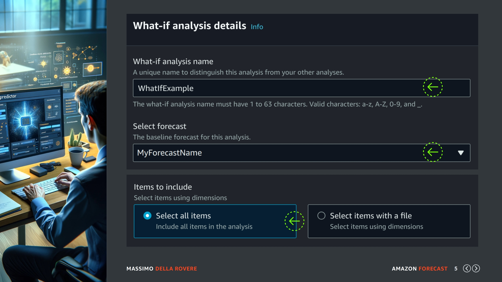

Questa è la schermata per la creazione di un'analisi What-IF che come vi ho indicato non è altro che una selezione di items da un forecast esistente. Quindi mettiamo il nome dell'analisi e il forecast di origine. A questo punto dobbiamo indicare se mettere sotto analisi tutti gli elementi del forecast o solo alcuni.

Normalmente è sempre meglio fare una selezione precisa dei prodotti da mettere sotto analisi, però nel nostro caso il Forecast già contiene pochi prodotti in quanto abbiamo creato solo un campione dei dati e quindi possiamo tranquillamente lasciare attivata l'opzione "select all items" sulla nostra analisi What-IF.
Se per caso avete fatto l'upload di un dataset molto grande con molti prodotti mi raccomando usate l'opzione per selezione da un file esterno solo i prodotti che volete per non aumentare i costi. 

Confermate la creazione con il pulsante che trovate più in basso e andiamo al passo successivo.

## (slide 6)

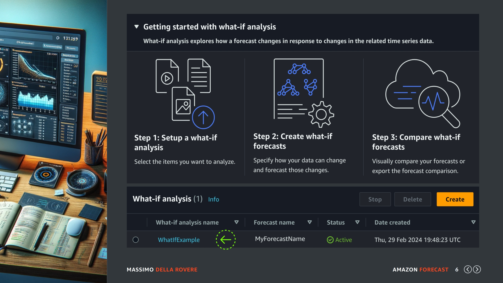

L'analisi è già stata creata e si chiama WhatIfExample (freccia verde). Come avete visto è stato semplice, in un singolo dataset potete creare diverse analisi con filtri diversi in modo da eseguire What-IF su categorie diverse. Se la vostra analisi già risulta in stato di Active entriamo al suo interno per visualizzare i dettagli.

## (slide 7)

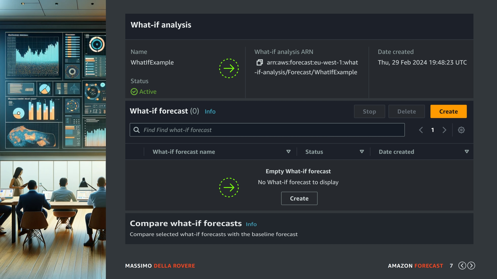

Nei dettagli dell'analisi possiamo notare come prima cosa la direzione ARN, necessaria per eseguire operazioni con strumenti a linea di comando o con codice di programmazione. A seguire ci sono i Forecast What-IF che sono diverse ipotesi che possiamo applicare agli items presenti nell'analisi stessa.

Dato che in questo momento non ne abbiamo nessuno disponibile clicchiamo sul pulsante di creazione per vedere come funzionano creando il primo What-IF forecast.

## (slide 8)

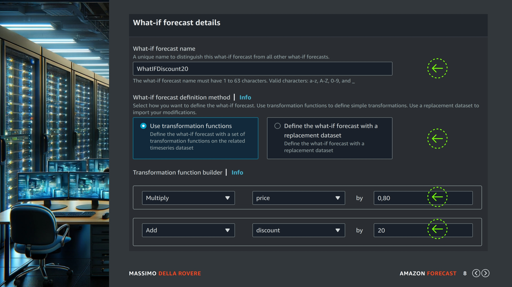

Nella schermata di creazione dobbiamo indicare un nome al Forecast What-IF nel nostro caso possiamo usare il nome WhatIFDiscount20, come metodo di condizionamento possiamo scegliere il valore predefinito "trasformazione tramite funzioni" è molto più semplice da creare e facile da seguire.

Esiste anche un metodo con file CSV con tutte le condizioni articolo per articolo. Ovviamente il secondo metodo è più potente dato che siamo liberi di calcolare i valori senza limiti, però è più complesso.

Come funzione di trasformazione moltiplichiamo il prezzo scontato per 0.80 (terza freccia verde) che dovrebbe corrispondere a fare uno sconto del 20% e aggiungiamo anche un valore 20 alla percentuale di sconto originale. Le condizioni sono molto basilari è possibile aggiungere delle condizioni where per essere più selettivi se necessario. In ogni caso se servono calcoli più complessi dovete creare un file CSV.

Confermiamo il Forecast What-IF e ripetiamo questo processo anche per una seconda ipotesi dove facciamo uno sconto del 40% e la chiamiamo WhatIFDiscount40.

## (slide 9)

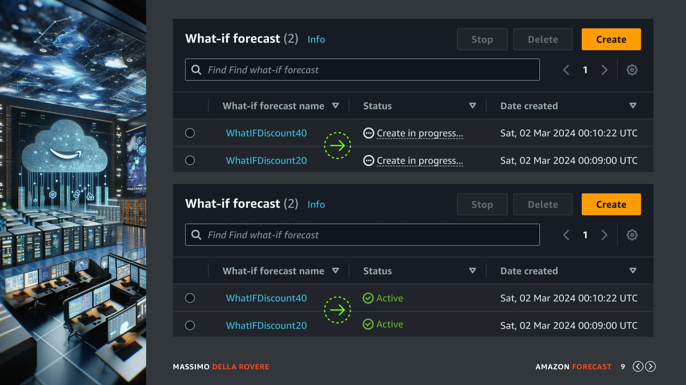

A questo punto i due What-IF Forecast si troveranno in stato di elaborazione, (prima freccia verde) aspettiamo qualche minuto fino a quando passeranno tutte e due in stato di active in modo che possiamo andare a provare il confronto. Ok se sono in stato di active andiamo più in basso nella pagina dove troviamo la sezione della comparazione delle previsioni What-IF.

## (slide 10)

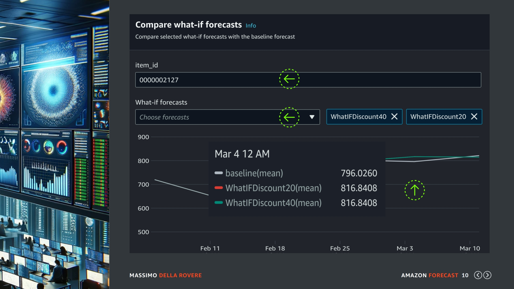

Una volta che i What-IF Forecast sono pronti possiamo indicare un item_id scegliere le due ipotesi appena create e richiedere il grafico di confronto. Come possiamo vedere in questo caso abbiamo ottenuto un aumento di vendite settimanale non molto significativo da 796 unità a 816 unità e non c'è differenza tra lo sconto 20% e 40%. Ovviamente tramite la console potete fare dei controlli a campione ma se volete la situazione completa basta fare come è di abitudine un export su Amazon S3.

## (slide 11)

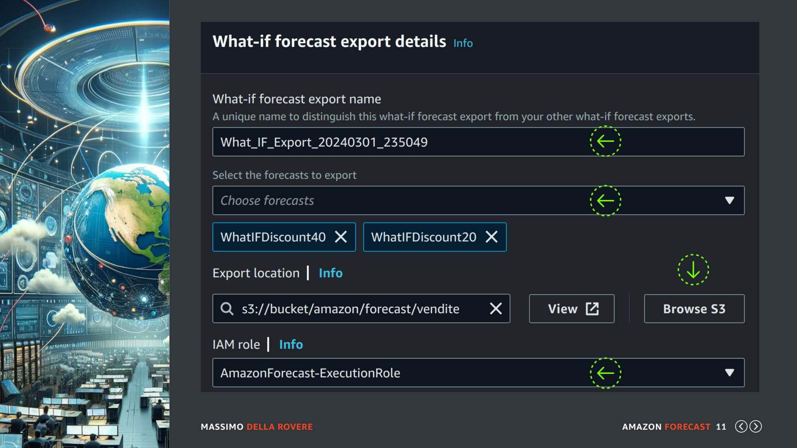

Per eseguire l'export come abbiamo visto in precedenza per altre risorse similari basta cercare la sezione EXPORT e cliccare sul pulsante per la creazione di un nuovo export job. Dobbiamo indicare il nome del lavoro di esportazione, selezionare i What-IF Forecast che vogliamo esportare, specificare il percorso su Amazon S3 per output del file e il ruolo che abbiamo usato sempre nelle precedenti esportazioni.

## (slide 12)

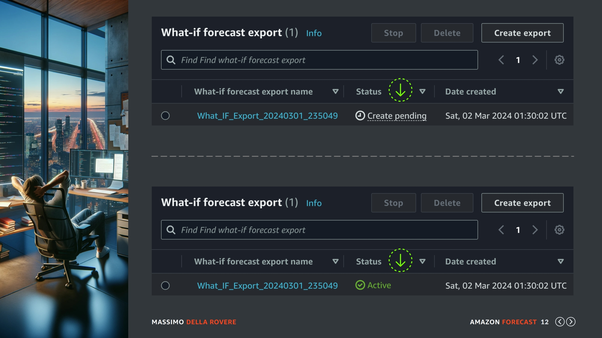

Una volta completata la richiesta di esportazione sarete dirottati sull'elenco degli export in cui dovreste vedere il vostro lavoro in stato di pending, aspettate qualche minuto e una volta che passa in stato di active scaricate il file dal bucket S3 o in alternativa integratelo nel vostro applicativo principale.

## (slide 13)

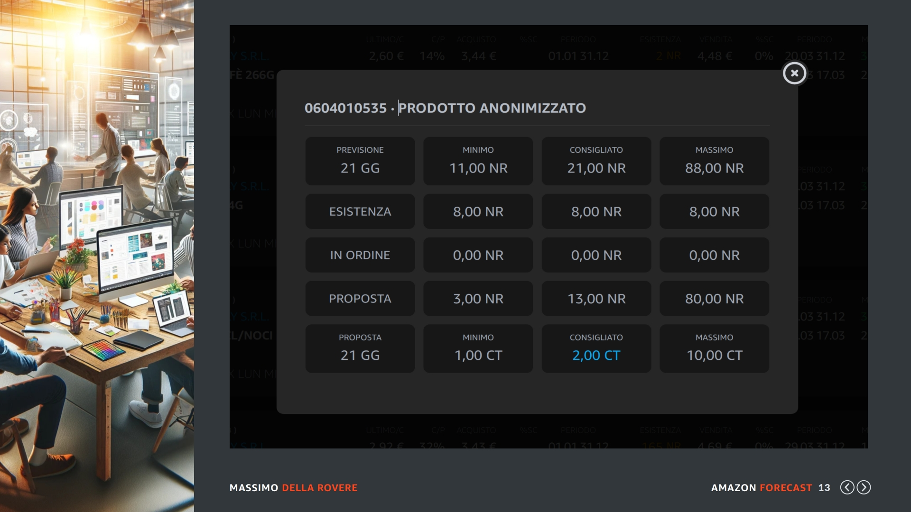

Ad esempio io prossimamente ho in roadmap di modificare questa schermata che un mio cliente usa in fase di riordino con un menu a tendina dove selezionare la % di sconto (tipo 10% 20% etc) e cosi far vedere come cambia la previsione direttamente alla persona incaricata agli acquisti.

Infatti il servizio di Amazon Forecast è utilissimo per le analisi massive ma secondo me da il suo vero valore aggiunto quando lo integrate nelle procedure operative dove l'azienda prende velocemente le decisioni.