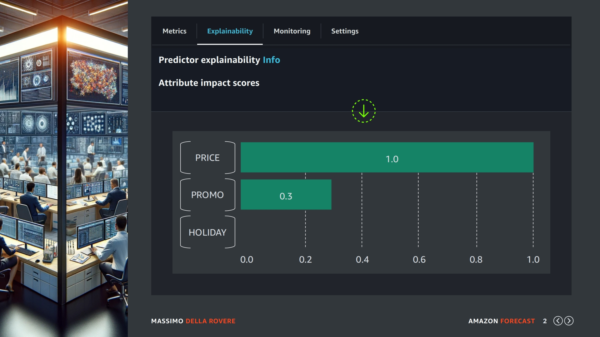
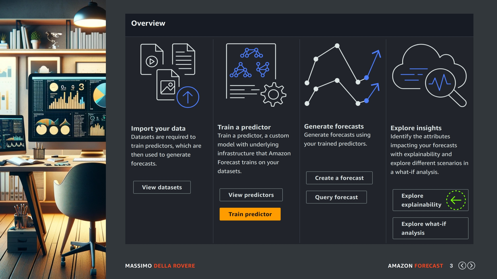
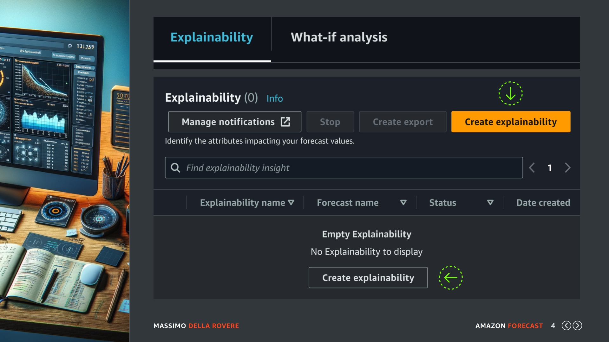
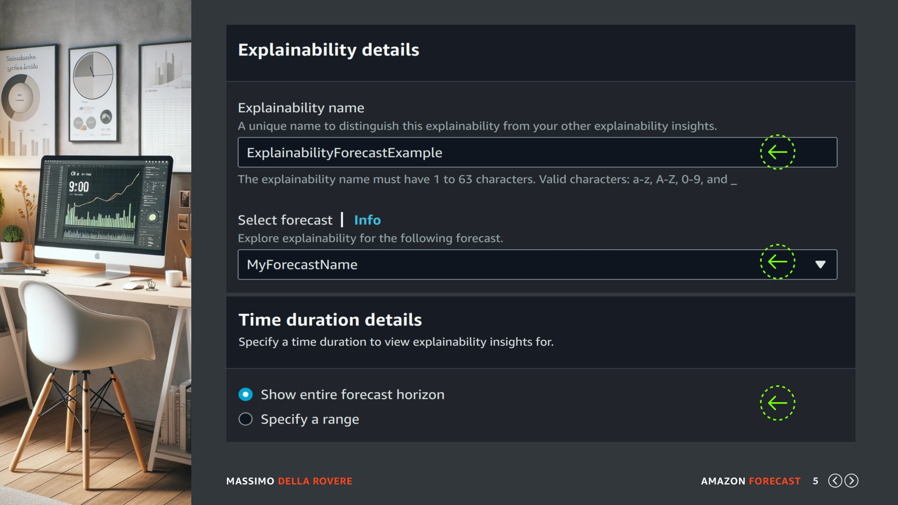
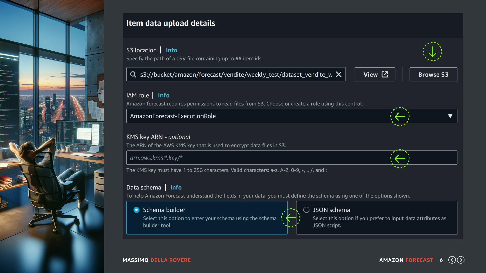
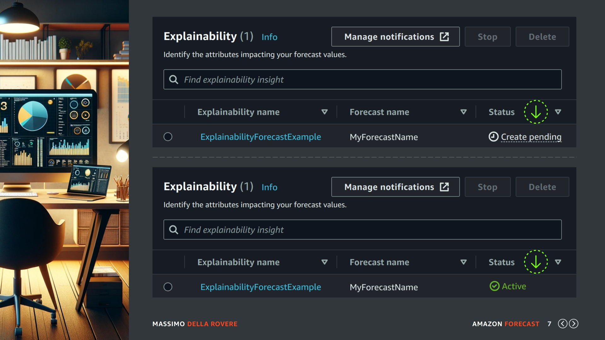
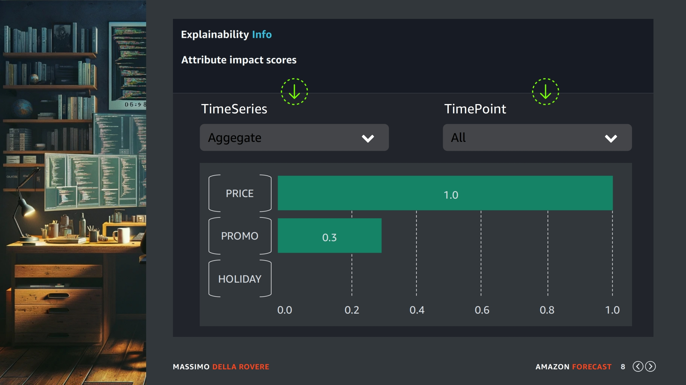
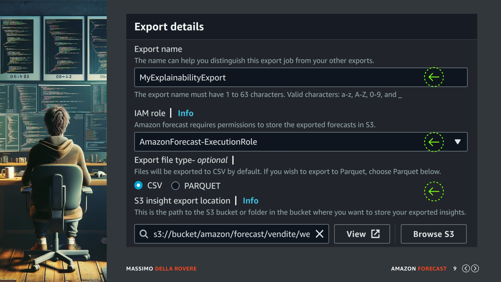

## (slide 1)

In questa lezione vedremo la spiegabilità del Forecast che ci permette di creare un Punteggio d'Impatto dei nostri dati correlati, come ad esempio colore, brand, categoria etc sulla previsione.

## (slide 2)

Facciamo un passo indietro riproponendo una slide presente nella sezione del predictor, anche li avevamo visto che la spiegabilità non era altro che una funzione che una volta attivata ci permetteva di vedere a livello di predictor l'impatto di alcuni valori come qui ad esempio il prezzo, la promozione e il calendario.

La spiegabilità di un forecast è la stessa identica cosa però cambia la dimensione. Ad esempio io ho un predictor di 15.000 prodotti e circa 5 anni di storico di vendita. Quando vedo la spiegabilità del predictor questa è riferita a tutto il campione completo non posso entrare nei dettagli.

Mentre la spiegabilità del Forecast (dove ho selezionato solo 4.000 prodotti dei 15.000) farà riferimento solo a questi 4.000 prodotti, il quale oltretutto può essere ulteriormente filtrato sia elencato alcuni codici che voglio prendere in considerazione ma anche solo alcuni periodi.

Detto questo andiamo a vedere come creare una spiegabilità Forecast.

## (slide 3)

Entriamo come sempre nel nostro dataset, nell'ultima sezione sulla destra trovate la parte "insight" dove al suo interno possiamo selezionare "Explore Explainabiliy". Clicchiamo e andiamo al passo successivo.

## (slide 4)

Saremmo dirottati nella sezione di Explainabiliy dove possiamo iniziare il processo di creazione con il pulsante giallo ben visibile sopra l'elenco principale o anche con il pulsante più in basso. Quindi procediamo con questa operazione e andiamo a creare la nostra prima spiegabilità.

## (slide 5)

Nella schermata di creazione dobbiamo indicare un nome e selezionare il Forecast di riferimento, che normalmente contiene solo una parte degli items che sono presenti nel predictor. Più in basso troviamo la selezione di un range di date o possiamo lasciare se necessario anche la selezione dell'intero orizzonte.

## (slide 6)

Qui dovete indicare il file CSV contenente gli items che si vogliono elaborare, potete usare lo stesso file con cui avete creato le previsioni forecast come potete usare un file con meno items. Nel mio caso avendo un forecast di 4.000 prodotti sono troppi per fare questa prova quindi selezionare un campione più piccolo.

Dopo aver selezionato il file dal vostro percorso S3 indicate come sempre il Ruolo di Esecuzione. Più in basso trovato lo schema di questo file di selezione che alla fine contiene solo il codice del prodotto senza nessuna informazione aggiuntiva quindi possiamo lasciare tutto di default.
Una volta che confermate la creazione della spiegabilità possiamo tornare da dove siamo partiti:

## (slide 7)

Qui possiamo vedere lo stato del lavoro di elaborazione che dovrebbe stare in pending. Aspettiamo qualche minuto, purtroppo in Amazon Forecast le attese sono molte bisogna avere pazienza. Una volta che lo stato passa in active come indicato dalla seconda freccia verde possiamo analizzare il risultato.

## (slide 8)

Entrando dentro la risorsa possiamo vedere un risultato simile a questo:

Vediamo le metriche di impatto per tutti i dati correlati che abbiamo indicato nel nostro dataset però abbiamo la possibilità rispetto al predictor di selezionare dei filtri. Ad esempio in TimeSeries possiamo selezionare un codice prodotto specifico e in TimePoint un periodo di tempo particolare.

## (slide 9)

Anche se può sembrare ripetitivo purtroppo va detto e anche la spiegabilità a livello di previsioni ha la sua funzione di Export su Amazon S3. Quindi date un nome al lavoro di esportazione, indicate il ruolo che abbiamo sempre usato fino adesso e indichiamo il percorso di destinazione su Amazon S3.

Confermiamo con il pulsante apposito e aspettiamo qualche minuto. Una volta finita l'elaborazione potete analizzare il file CSV generato e aprirlo con il vostro strumento preferito.