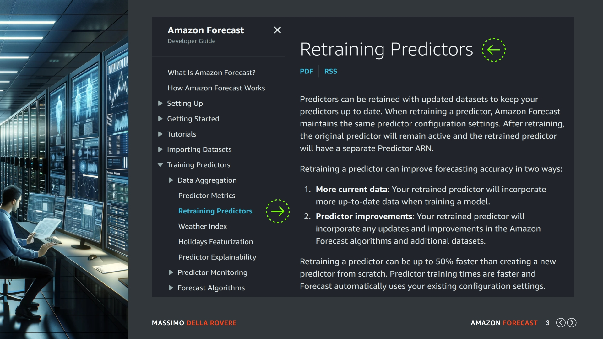
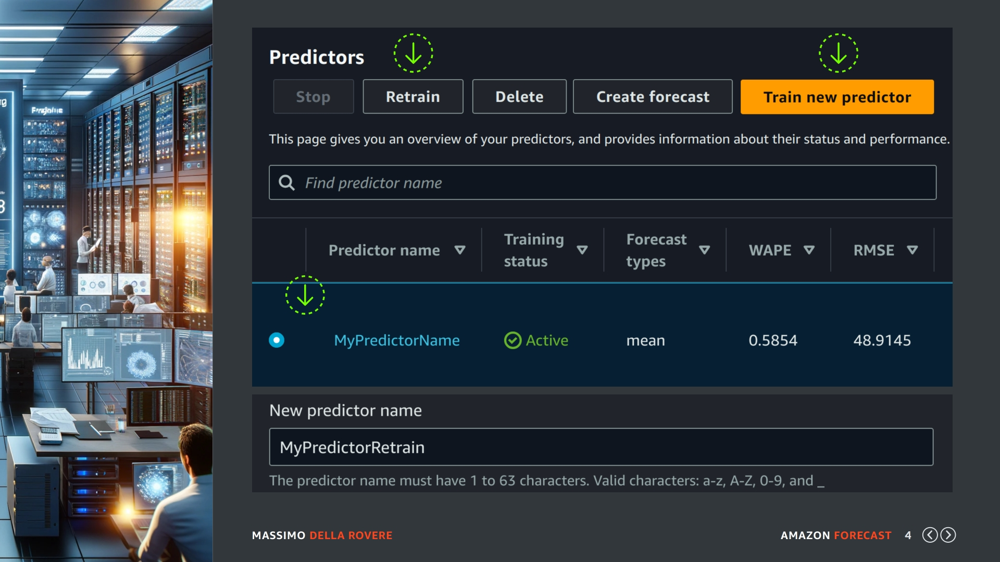
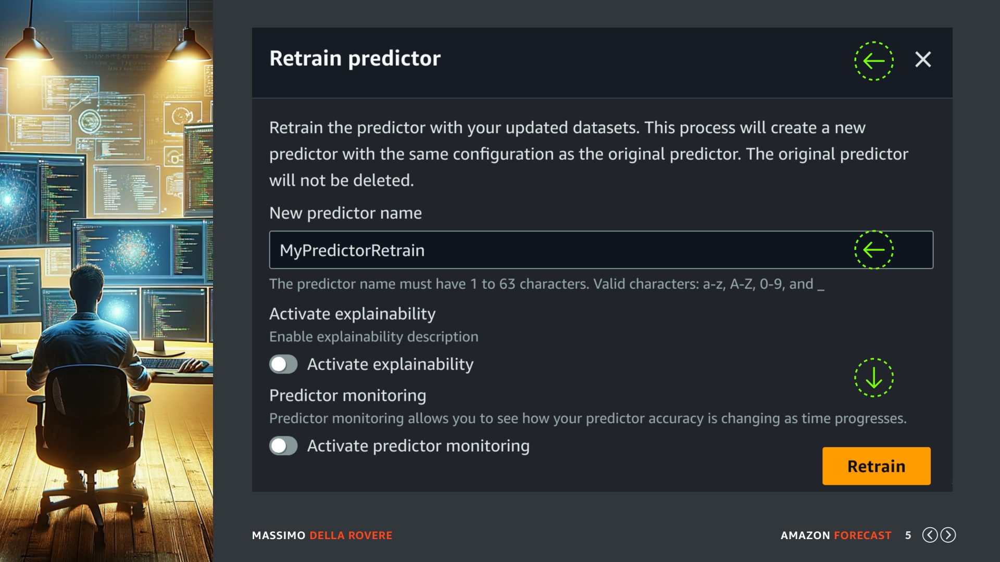
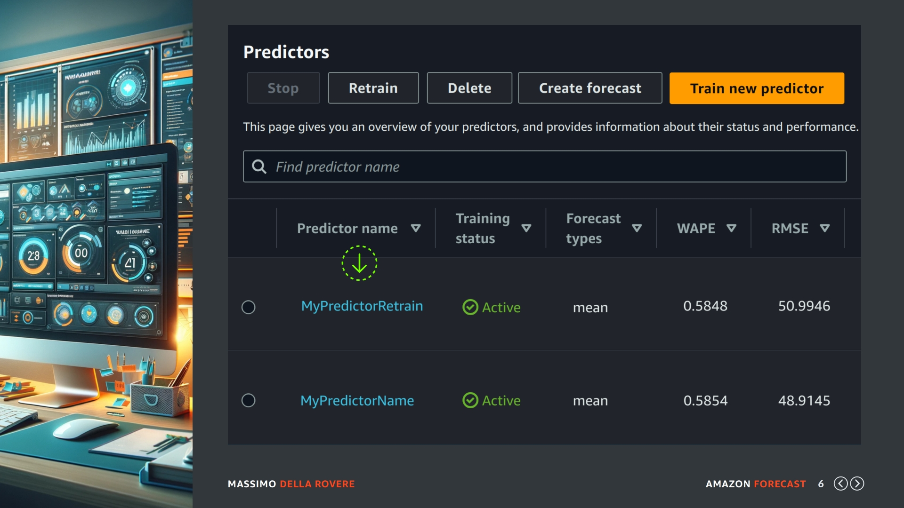
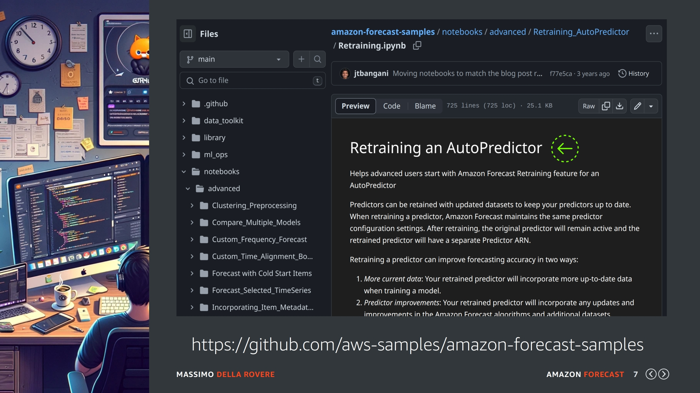

## (slide 1)

In questa lezione vedremo in modo più approfondito la parte di training che riguarda il nostro predictor. In realtà abbiamo già visto le cose più importanti però ho lasciato alcune considerazione nella parte avanzata del corso, questo perché ho notato che mettere tutto insieme nelle prime lezioni della creazione di un predictor, specialmente per chi è agli inizi, crea più svantaggi che vantaggi di apprendimento.

## (slide 2)

Facciamo un piccolo riassunto, come possiamo vedere da questa slide quando generiamo le nostre previsioni possiamo usare un predictor in tre modi:

**(1) LA CREAZIONE DEL PREDICTOR**

Dopo il caricamento dei dataset o il loro aggiornamento creiamo un nuovo predictor rielaborando da capo tutto il modello, quindi analisi dei dati, aggregazione, algoritmi, metriche etc. Il risultato sarà un modello allenato fino ai dati più recenti e con le ultime eventuali feature di Amazon Forecast.

**(2) USARE UN PREDICTOR ESISTENTE**

Se eseguiamo un aggiornamento dei dati di un esteso dataset, ad esempio aggiungiamo una settimana di vendite ad un dataset di 5/10 anni di storico con molta probabilità il TRAIN eseguito precedentemente è ancora valido per generare le nueve previsioni senza dover ricreare il modello.

**(3) RETRAIN PREDICTOR**

Questa opzione non era stata indicata precedentemente nel corso, ed è molto utile in diversi casi, specialmente in modelli che necessitano di tempi di elaborazione molto lunghi. Con RETRAIN viene creato un nuovo predictor con tutte le opzioni di quello originale senza che queste debbano essere specificate di nuovo e la sua elaborazione puó arrivare anche a risparmiare il 50% del tempo di elaborazione. Il predictor originale rimarrà attivo e il predictor riqualificato avrà un ARN Predictor separato.

## (slide 3)

Secondo la documentazione ufficiale ci sono due motivi per cui un RETRAIN predictor migliorerà la generazione delle prossime previsioni:

- Il tuo predictor riqualificato incorporerà dati più aggiornati durante l'addestramento di un modello.
- Il tuo predictor riqualificato incorporerà eventuali aggiornamenti e miglioramenti negli algoritmi Amazon Forecast e nei set di dati aggiuntivi.

## (slide 4)

Per eseguire un RETRAIN basta andare sulla pagina dei predictor presenti nel dataset group selezionato, qui trovate il pulsante in giallo per creare un nuovo predictor che abbiamo già conosciuto nelle lezioni precedenti, se in questa lista selezionate un predictor esistente vi comparirà il pulsante RETRAIN indicato su questa slide dalla prima freccia verde, clicchiamo su questo pulsante e andiamo al passo successivo.

## (slide 5)

Come potete vedere basta inserire il nome del nuovo predictor e cliccare Retrain. Non è necessario indicare nessuna opzione in quanto il nuovo modello avrà le stesse caratteristiche di quello originale. Potete anche attivare le funzionalità si spiegabilità che abbiamo visto nelle lezioni precedenti e Monitoring che affronteremo invece nelle slide successive al RETRAIN.

Clicchiamo RETRAIN e aspettiamo la fine dell'elaborazione.

## (slide 6)

Finita l'elaborazione possiamo notare che abbiamo una nuova risorsa predictor anche se l'azione chiamata RETRAIN potrebbe portare fuori strada. Quindi avremo un nuovo indirizzo ARN il quale dovrà essere usato per la generazione delle previsioni successive. Come vedremo successivamente anche sul monitoring i predictor riqualificati hanno una caratteristica diversa rispetto a quelli creati ex novo.

## (slide 7)

Una risorsa che vi voglio consigliare se volete andare in profondità e vedere passo passo il processo senza essere facilitati dalla management console sono gli esempi presenti in GITHUB, dove ne trovate uno proprio sul RETRAIN di un predictor in Amazon Forecast da usare in un notebook Jupyter.