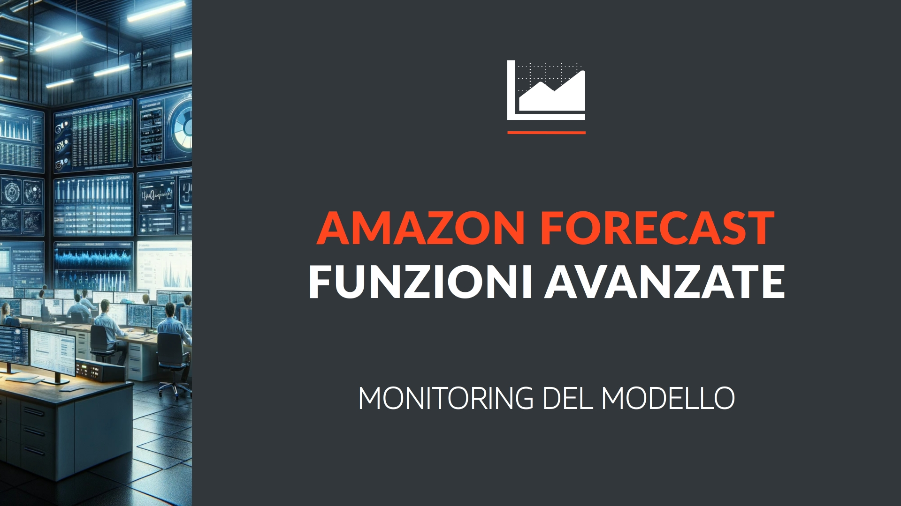
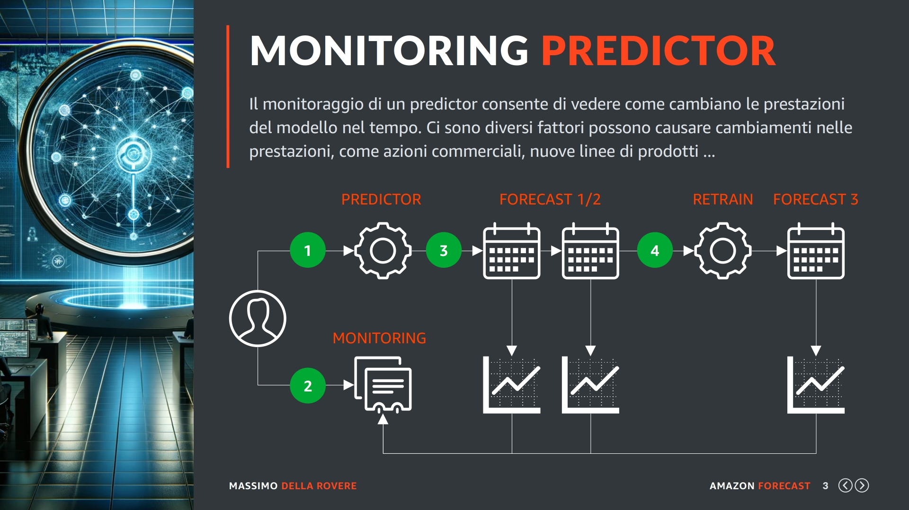
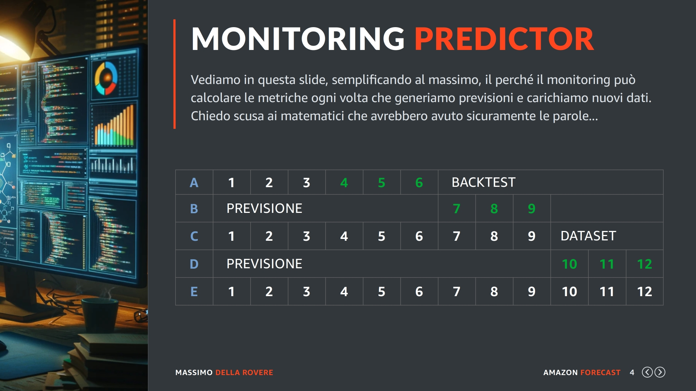
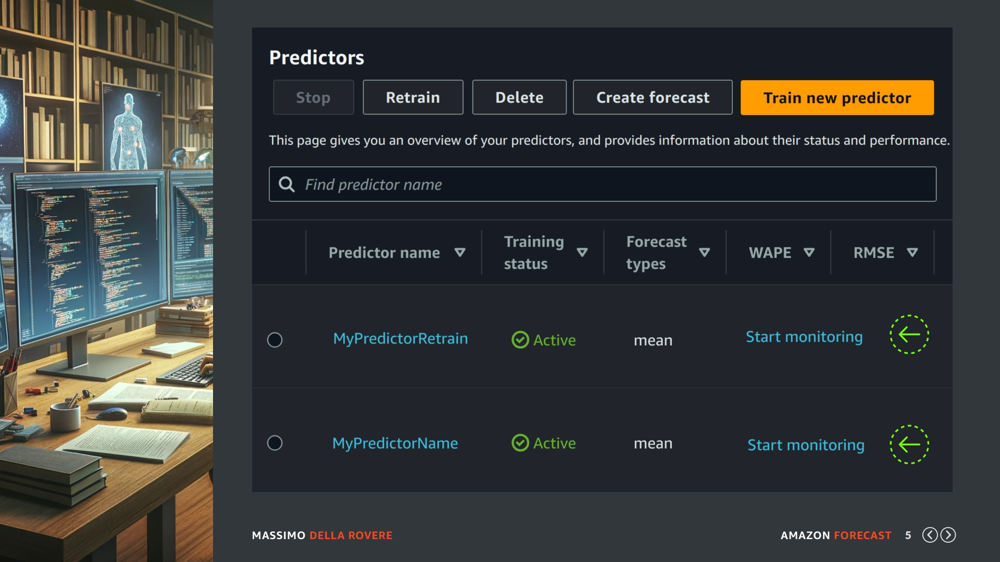
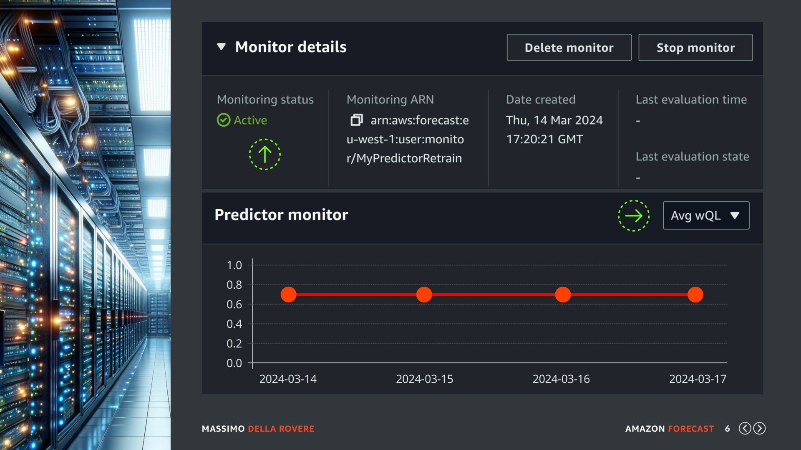
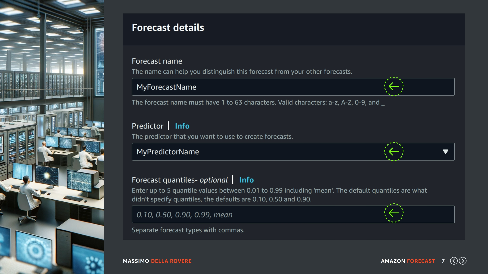
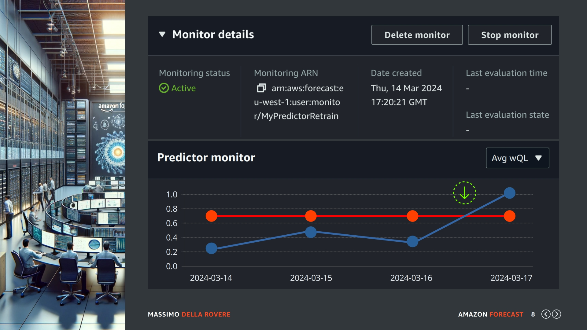
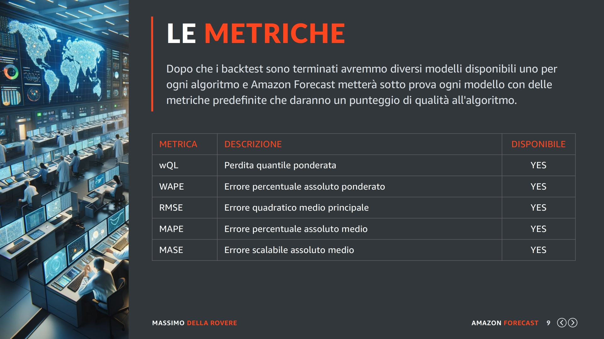

## (slide 1)

Purtroppo i modelli di Amazon Forecast non sono come i diamanti che durano per sempre, hanno bisogno di manutenzione e controllo constanti. Alcune volte bisognerà riallenarli e altre volte ricrearli da capo. Per sapere come e quando, Amazon ci mette a disposizione una funzionalità chiamata Monitoring.

## (slide 2)

Un modello è la risorsa indispensabile per la generazione delle previsioni (forecasts), però abbiamo visto che quando generiamo delle nuove previsioni possiamo farlo in diversi maniere: creare un nuovo modello, usarne uno nuovo o eseguire il RETRAIN di uno esistente.

Quindi la domanda ovvia è fino a quando possiamo usare lo stesso modello?

La risposta è fino a quando il modello genera previsioni affidabili. Ci sono casi in cui le vendite hanno un comportamento molto stabile nel tempo e i prodotti cambiano poco, in questi casi un modello potrebbe essere usato molte volte anche se continuiamo ad aggiornare i dataset.

Però ci sono anche condizioni in cui non abbiamo molto storico, le vendite sono imprevedibili, le linee dei prodotti cambiano continuamente, i prodotti venduti dipendono molto dalla moda del momento etc etc, in questi quasi sicuramente ci troveremo a dover riallenare il modello diverse volte.

Per sapere quando un modello inizia ad essere meno affidabile abbiamo bisogno di una metrica che possiamo controllare nel tempo dopo ogni generazione di previsioni. Qui entra in gioco il monitoring.

## (slide 3)

Il monitoraggio di un predictor consente di vedere come cambiano le prestazioni del modello nel tempo. Ci sono diversi fattori possono causare cambiamenti nelle prestazioni, come azioni commerciali, nuove linee di prodotti o semplicemente cambiamenti nel comportamento dei clienti.

In questa slide vediamo come funziona il monitoring:

Passo (1): Creiamo il nostro primo predictor come abbiamo già fatto in questo corso.

Passo (2): Attiviamo il monitoring sul predictor appena creato (lo vediamo subito dopo)

Passo (3): Generiamo le previsioni o aggiorniamo i nostri dataset. I risultati saranno memorizzati nel monitoring attivo. La prima volta il monitoring avrà i dati del backtest, dopo saranno aggiornati con la prima previsione, poi con i nuovi dati che arrivano, con la seconda previsione e cosi via,

Passo (4): Decidiamo di fare un RETRAIN del modello, il predictor risultante sarà un nuovo modello ma il monitoring sarà copiato interamente sul nuovo predictor e quindi il monitoraggio continua. Se invece dovessimo creare un predictor ex novo anche il monitoraggio viene reinizializzato.

## (slide 4)

Vediamo in questa slide, semplificando al massimo, il perché il monitoring può calcolare le metriche ogni volta che generiamo previsioni e carichiamo nuovi dati. Chiedo scusa ai matematici che avrebbero avuto sicuramente le parole tecniche per spiegarlo alla perfezione, però mi devo arrangiare con quello che ho.

Nella linea (A): Carichiamo il nostro primo dataset con i valori 1,2,3,4,5,6. Quando creiamo il predictor con il monitor attivato il backtest genera le prime metriche in quanto 4 5 6 vengono usati come test di previsione.

Nella linea (B): Lanciamo la generazione delle previsione con la quale verranno generati i numeri 7,8,9. E sappiamo che lo stiamo facendo con predictor appena creato e con determinate metriche di punteggio.

Nella linea (C); Passano diciamo tre settimane e arrivano nuovi dati al nostro dataset, questa volta arrivano anche i valori 7,8,9 che non sono più previsioni ma numeri reali. Con questi si possono creare altre metriche che finiranno nello storico del monitoring insieme a quelle precedenti.

Nella linea (D): Generiamo nuove previsioni 10,11,12

Nella linea (E): Arrivano nuovi dataset e cosi via..

Quando creeremo un nuovo predictor ricominciamo tutto da capo con un nuovo monitoring.

## (slide 5)

Per attivare il monitoring abbiamo due soluzioni, attivarlo durante la creazione del predictor o attivarlo successivamente alla creazione. In questa slide ho due predictor senza monitoring attivato quindi posso usare l'ultimo MyPredictorRetrain e attivarlo con il link indicato dalla freccia verde.

## (slide 6)

Una volta attivo il monitoring dovremmo vedere i dettagli del monitoring come l'indirizzo ARN e lo stato impostato su Active. Il primo grafico di ogni metrica presente in questo momento del monitoring dovrebbe essere una linea piatta con le stesse metriche assegnate durante la creazione del predictor. Con la seconda freccia verde sulla destra potete selezionare la metrica che volete analizzare.

## (slide 7)

A questo punto possiamo iniziare il ciclo di creazione forecast (come vediamo in questa slide), caricamento di nuovi dataset etc come spiegato nelle slide precedenti. Non è necessario rivedere tutti i passi, sono cose che abbiamo già fatto precedentemente e a questo punto del corso dovrebbero essere già chiare.

## (slide 8)

Quindi dopo un po' di tempo, quando avete almeno concluso un ciclo andate ad analizzare di nuovo il monitoring a questo punto dovreste trovare dei dati diversi con il grafico aggiornato.

Andando ad analizzare le metriche che potete selezionare con il menu a tendina sulla destra del grafico, potete vedere l'andamento di quest'ultime considerando che quando i valori delle metriche si alzano significa che il modello sta peggiorando. Purtroppo non esistono dei riferimenti precisi per dire se una metrica è positiva o negativa rispetto ad un valore X, tutto è relativo caratteristiche dei dati.

Nel monitoraggio delle prestazioni del tuo modello, puoi vedere come le metriche (MSE, MAPE, e altre che potresti utilizzare) cambiano nel tempo con l'aggiunta di nuovi dati e la generazione di nuove previsioni.

Un miglioramento nelle metriche indica che il tuo modello si sta adattando bene ai nuovi dati, mentre un peggioramento può suggerire la necessità di un RETRAIN o anche di revisione del modello.

## (slide 9)

Vi ripropongo una slide già pubblicata nelle lezioni che riguardavano il predictor, qui vedete le metriche utilizzate da amazon per valutare la qualità di un modello. Come vedete non è possibile indicare un valore di riferimento per dire al di sotto è positivo e oltre è negativo, vediamo il perchè:

(1) Dipende dal Contesto: Per alcune serie temporali, soprattutto quelle altamente volatili o difficili da prevedere, un MAPE più elevato potrebbe ancora essere considerato un buon risultato. Ad esempio, prevedere le fluttuazioni di mercati finanziari altamente speculativi potrebbe naturalmente portare a un MAPE più alto rispetto alla previsione della domanda di un prodotto di consumo stabile.

(2) Confronto con un Benchmark: Spesso, è utile confrontare il MAPE del tuo modello con quello di un modello di riferimento o benchmark. Questo potrebbe essere un semplice modello statistico o semplicemente una media storica. Un miglioramento significativo rispetto a questo benchmark indica che il tuo modello sta fornendo valore aggiunto.

(3) Obiettivi Specifici: Gli obiettivi della tua previsione influenzano anche come interpreti il MAPE. Se le conseguenze di una previsione inaccurata sono elevate, potresti puntare a un MAPE più basso.

Quindi come potete vedere dipende dalle caratteristiche del dato, stabili o volatili ma anche dagli obiettivi della vostra azienda o del vostro cliente, per capire quando alcuni dati sono accettabili e quando no.

Molti consigliano di cercare in internet dei benchmark su modelli che fanno la stessa cosa di quello che volete generare, ad esempio ambiente RETAIL con previsione delle vendite e poi confrontare questi valori con quelli generati da Amazon Forecast per i nostri modelli.

Un'altro consiglio che vi aggiungo io, è che normalmente se si ha un quantitativo di dati importante e si crea un modello in Amazon Forecast possiamo fidarci che un AutoPredictor con tutti gli algoritmi a disposizione di amazon e le sue caratteristiche di analisi rendono il modello accettabile, quindi semplicemente dobbiamo tenere sotto controllo il monitoring e intervenire quando questi valori peggiorano.